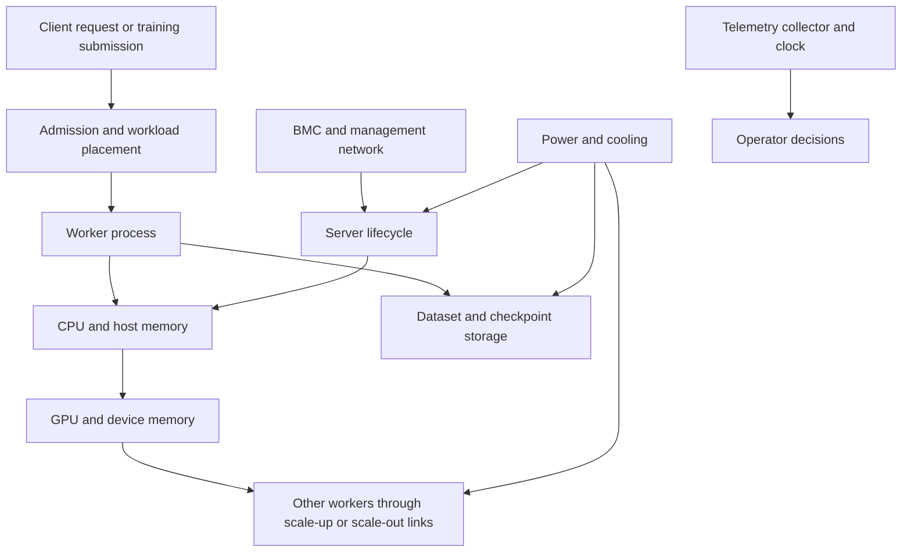

# Month 1: map the system and bound a failure

A training job can stop while every GPU dashboard remains green. A serving service can disappear while both replicas are healthy individually. Your first task is to explain how these observations can coexist. The useful object is the dependency path from the user's request to the resources that let it complete.

**Prerequisites:** the [bridge](00-bridge.md), or equivalent comfort with processes, files, network endpoints, units, and configuration. No machine-learning background is assumed.

**Assessed bundle:** G1-E01. G1-O01 maps request-to-rack dependencies. G1-O02 bounds a fault and its safe experiment. L0 is sufficient for these reasoning outcomes. There is one assessed bundle in this month; the practice prompts are parts of it.

**Evidence scope:** the rack below and every numerical example are teaching models, not a specification for a NVIDIA product. Public product documentation provides an example of separate GPU, cluster-network, storage-network, BMC, and power components in a real system; it does not establish that your hardware has the same arrangement. See the [DGX H100/H200 hardware overview](https://docs.nvidia.com/dgx/dgxh100-user-guide/introduction-to-dgxh100.html).

## Follow one request before drawing the fleet

An inference request asks a trained model to compute an output. A training job repeatedly computes predictions, compares them with a target, and updates model parameters. Both need compute and data, but a serving request also has an individual user waiting for its result. Later chapters explain the mathematics. For now, follow the things that must cooperate.

The client reaches a service endpoint. A workload platform places processes on servers. Those processes load code and model data, use CPU memory, submit work to a GPU, exchange data if necessary, and return a result. Management systems provision, observe, and repair the equipment around that path. Power and cooling make all of these possible.



This is a dependency diagram, not a packet diagram: an arrow means "depends on or influences," not necessarily "sends a network packet." Separate those meanings when you draw your own map. Otherwise a management API arrow can be mistaken for the application's data path.

A *control plane* decides and coordinates. A *data plane* carries the work being performed. An *out-of-band management path* can reach server management functions independently of the host operating system. None is magically independent of every shared resource. A management network can still share a power feed, switch, identity provider, or operator error with the workload path.

## A failure domain is a set of things one event can affect

Two processes on one server have separate process identities but share its kernel, hardware, and power. Two servers can share a rack switch. Two racks can share a power distribution unit or upstream service. Redundancy must be evaluated relative to an event: process crash, node loss, rack-network loss, power-feed loss, storage loss, or a bad configuration rolled to all replicas.

The *blast radius* is the affected set after the event propagates through dependencies. It need not match the component that first failed. If storage becomes unavailable, healthy GPUs may stop making progress because they cannot read the next batch. If authentication fails, health endpoints may return errors even while computation continues. Diagnosis should connect a symptom to a hypothesis and then to a discriminating observation.

**Worked example 1: two replicas and one feed.** Suppose `node-a` and `node-b` both use `feed-a`. Each hosts one serving replica capable of 60 requests/s. Normal demand is 80 requests/s. Before failure, nominal capacity is `2 * 60 = 120 requests/s`; utilization relative to that simplified capacity is `80 / 120 = 0.667`.

If `feed-a` fails, both replicas are lost and remaining capacity is zero. The number "two" gave process redundancy, not feed redundancy. Move the second replica to `node-c`, which uses `feed-b`. After losing `feed-a`, one replica survives with 60 requests/s of nominal capacity. Availability improved, but `80 - 60 = 20 requests/s` still exceed the surviving capacity. Placement and capacity are separate obligations. To claim full service during that fault, you need reduced admitted demand, more surviving capacity, or an explicitly relaxed service objective. The lab checks a surviving replica only; it does not prove this stronger capacity requirement.

**Counterexample:** two nodes in different racks can still fail together after a global configuration change. Physical separation does not protect against identical bad software. Your map therefore needs both shared physical dependencies and shared rollout dependencies.

## Write hypotheses that can lose

"The network is broken" is too broad to guide a useful experiment. A testable statement identifies a scope and a prediction: "Workers can reach the service address but cannot establish TCP to port X after the firewall change." A successful connection from the affected worker would weaken that statement. A successful ping from your laptop would not settle it.

Use four evidence labels in your notes:

- **Verified observation:** the command, input, time, and output you personally captured.
- **Verified public fact:** a statement within a cited source's documented scope.
- **Inference:** an explanation supported by observations but not uniquely proven.
- **Unknown:** information you still need. A synthetic fact is additionally labeled **SYNTHETIC_L0**.

These labels prevent an attractive story from becoming a false fact. For example, a log saying "timeout" is an observation; "a cable failed" is an inference until another test narrows the cause. Do not count the absence of an alert as verified health until you know the alerting path is collecting current data.

| Symptom | Competing hypotheses | Small discriminating check | What the check cannot establish |
|---|---|---|---|
| All workers stop | Shared storage unavailable; shared control dependency; synchronized application bug | Compare last successful storage operation, worker logs, and control-plane events | A cause from timing correlation alone |
| One worker is slow | Host contention; different topology; data skew | Compare identical bounded work and placement with a control | Fleet-wide failure rate |
| Both serving replicas vanish | Common power/feed; shared switch; bad rollout | Trace each replica's upstream dependencies and rollout revision | Which physical component failed without telemetry |
| Dashboard is green | Healthy system; stale collector; wrong asset labels | Check sample age and emit/observe a safe known signal | Hardware qualification |

## Safe experiments have a defined stop and a defined recovery

Before a test, write the question, the smallest affected set, the expected failure, the positive control, an abort condition, and the recovery postcondition. "Rollback if needed" is insufficient: name the previous configuration, who can apply it, and how you will know service is restored.

For L0, an injected feed failure is just data in a JSON fixture. For real equipment, removing power, changing firmware, resetting a GPU, modifying cooling, or manipulating cabling is a different operation requiring the relevant owner and safety process. This course does not authorize it. NVIDIA's DGX safety guide limits integration and service to technically qualified people; the relevant facility and exact product manual govern real work. Read [the safety guide](https://docs.nvidia.com/dgx/dgxh100-user-guide/safety.html) as an example, not as a universal servicing manual.

**Worked example 2: bounding a canary.** You propose a runtime configuration change on a synthetic 100-node fleet. A one-node canary limits direct exposure to `1 / 100 = 1%` of nodes. But that node participates in a 16-worker synchronous training job. One failed worker can stop that job, so affected job capacity is 16 workers, not one. If that job is the only one serving a deadline, the business impact can be 100% of that deadline. Choose a separate test job and explicitly reserve its resources. The correct unit of risk can be a job, tenant, or dependency rather than a node.

The canary plan's positive postconditions are: the test process runs the intended revision; its output matches a known result; its telemetry is current; and returning to the prior configuration restores the original result. A process that merely starts satisfies none of the last three automatically.

## Four-week study route

These 9-hour weeks are provisional study allocations, subordinate to the central calendar. Weeks 1-3 introduce/build; week 4 consolidates and repairs gaps rather than introducing another mandatory unit.

| Week | Study and read | Apply | Review | Total |
|---|---|---|---|---|
| 1 | 3 h: this chapter through failure domains; inspect the product overview | 4 h: draw one request path and label shared dependencies | 2 h: explain map to a peer or record yourself | 9 h |
| 2 | 3 h: hypotheses and evidence labels | 4 h: run the domain model, compare fault and healthy control | 2 h: distinguish observations from explanations | 9 h |
| 3 | 2 h: safe experiments and canary example | 5 h: propose and execute a bounded placement change in L0 | 2 h: calculate surviving capacity separately | 9 h |
| 4 | 2 h: revisit weak explanations | 4 h: fresh attempt and G1-E01 packet | 3 h: defense, feedback, remediation | 9 h |

## G1-E01: preserve a service across the specified fault

Start with [the lab instructions](../labs/systems/README.md). From the repository root:

```bash
python3 labs/systems/lab.py init domains --workspace learner-work/systems/domains
python3 labs/systems/lab.py observe --workspace learner-work/systems/domains
python3 labs/systems/lab.py check --workspace learner-work/systems/domains
```

The check must fail initially. Capture that output. Draw the nodes, racks, and feeds from the observations; predict how many replicas survive before changing anything. Choose `secondary` using the control schema. Use `configure` to change it, then run `observe` and `check` again. Create a separate healthy control with `init ... --control healthy` and compare the derived outputs. Finally use `reset`, which restores only the lab configuration and preserves evidence/history, and confirm the original failure returns.

Submit one packet using [the evidence template](../assessments/evidence-template.md): your map, two competing hypotheses, the prediction, original failure, chosen configuration, recovered result, healthy control, reset result, and a one-paragraph boundary statement. The machine checks replica survival; a reviewer checks whether you understand the untested capacity and shared-dependency risks.

## Checkpoint questions

1. A GPU is reachable from a management tool. What can still prevent a user request from completing?
2. Why can a one-node canary affect a 16-node job?
3. What makes the domain lab's healthy control stronger than an empty error log?
4. After recovery, one replica remains and is saturated. Did the lab pass? Did full service capacity pass?

<details>
<summary>Answer key and misconception check</summary>

1. Admission, identity, model/data loading, application correctness, network, peer workers, and response routing can still fail. Reachability establishes one link in the path.
2. A synchronous job can depend on every participating worker. The job is an additional failure domain above the server.
3. It demonstrates a specified successful outcome under the same modeled fault. An empty log could result from no collection, no traffic, or missing checks.
4. The replica-survival invariant can pass while the stronger demand/capacity objective fails. State both results with their scopes.

For the supplied L0 topology, placing the secondary on `node-c` leaves one surviving replica after `feed-a` loss. `node-b` shares the failed feed; `node-a` also violates distinct-node placement. This is a configuration answer, not permission to move a production workload.

</details>

**Next:** [Month 2: server topology, identity, and management](02-server-control.md). Carry forward the distinction between a named component and the dependencies that make it usable.
