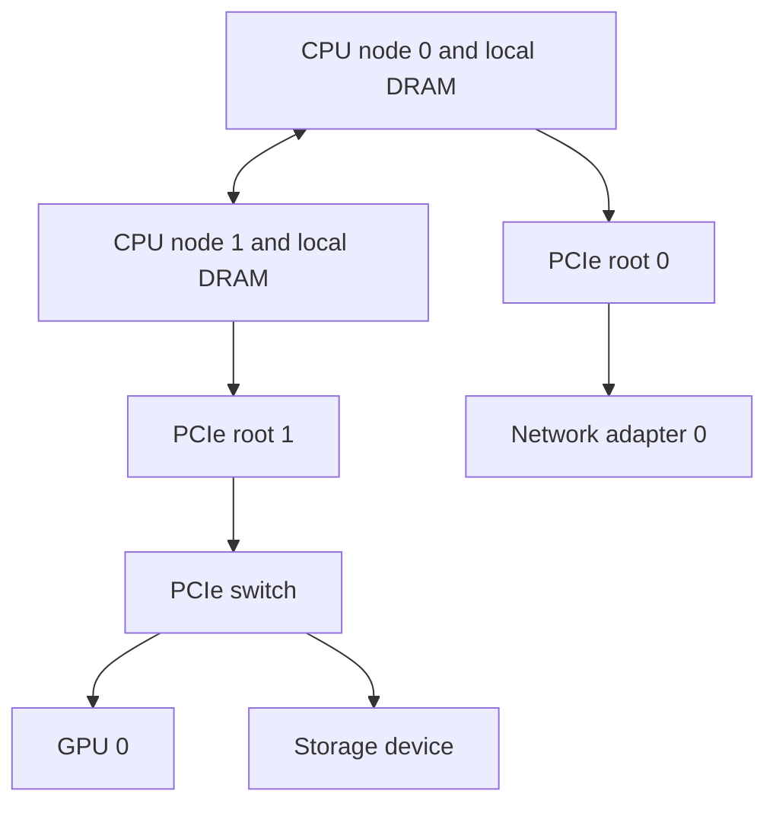

# Month 2: know which server you are changing

You receive two reports: a worker became slower after maintenance, and the inventory says its firmware is current. Neither statement tells you whether the correct machine was checked. This chapter builds the path from durable identity to topology to a safe lifecycle change. It also explains why adding more CPU cores can fail to improve a GPU job.

**Prerequisites:** month 1; bytes versus rates; process memory and configuration. **Assessed bundle:** G1-E02. G1-O03 reconciles host, management, and inventory identity. G1-O04 explains topology and a safe lifecycle change. The supplied records and timings are synthetic. Hardware facts below are scoped to cited interfaces, not to every server model.

## CPU, memory, and the distance hidden by an address

A CPU executes host instructions. DRAM stores the process's working data. A CPU socket is a physical processor package, while a core is one execution resource inside it. A logical CPU is what the operating system schedules on; its relation to physical cores depends on the hardware configuration. Never equate a count of logical CPUs with the same number of independent physical cores without inspecting topology.

In a non-uniform memory access system, or **NUMA** system, memory is associated with locality domains called nodes. A CPU can address memory attached to another node, but the path can differ in latency and bandwidth. NUMA is about access cost and placement, not about one process being forbidden to see another node's memory. A process can run on one node while much of its data resides on another.

Linux separates scheduling placement from memory policy. Setting a memory policy affects future relevant allocations; it does not automatically relocate all pages that already exist. Policies also interact with the set of nodes the task is permitted to use. That is why "I changed affinity" is not proof that the data path changed. These boundaries are documented in the [Linux NUMA memory policy guide](https://docs.kernel.org/admin-guide/mm/numa_memory_policy.html).

For a GPU job, host-side data preparation can be the bottleneck. The CPU may decode input, allocate a batch, and copy it toward an accelerator. If the CPU, its pages, and the device attachment are on different locality paths, increasing worker count may increase contention rather than improve delivery. This is a hypothesis to test, not a guarantee that local placement always wins: an overloaded local node can lose to a less busy remote node.

## PCIe is a topology, not a flat list of devices

Peripheral Component Interconnect Express (**PCIe**) connects devices through links, root complexes, and sometimes switches. A root complex connects the CPU/memory side to a PCIe hierarchy. Devices sharing an upstream link may contend for that link even when their downstream links look fast.

Linux names a PCI function with a domain, bus, device, and function address, often abbreviated **BDF**: `0000:81:00.0`. It is a location in the enumerated hierarchy, not a universally permanent asset serial number. Linux sysfs exposes attributes such as vendor/device IDs, resource information, and local CPUs. Some sysfs files are writable controls, including device removal, so this course reads selected attributes and never writes to sysfs. See [accessing PCI resources through sysfs](https://docs.kernel.org/PCI/sysfs-pci.html).

This is a teaching topology. Trace both CPU-to-GPU and GPU-to-network paths. If a diagram omits the inter-socket link or shared upstream switch, it can hide the resource you need to measure. A network interface card (**NIC**) is the device connecting the host to a network; a GPU and NIC being in the same chassis does not imply the shortest available path between them.

**Worked example 1: transfer time and Amdahl's limit.** A synthetic preprocessing step has three serial parts: decoding takes 18 ms; copying a batch on the remote memory/device path takes 24 ms; GPU computation takes 12 ms. Total is `18 + 24 + 12 = 54 ms`, so the no-overlap upper throughput is `1000 / 54 = 18.52 batches/s`.

After correcting placement, the measured copy time is 12 ms. New total is `18 + 12 + 12 = 42 ms`; throughput becomes `1000 / 42 = 23.81 batches/s`. The copy is twice as fast, but the whole step is only `54 / 42 = 1.286` times as fast, a 28.6% increase. The unaffected work prevents a 2x end-to-end gain. If copies and computation overlap, summing them overestimates time; measure the actual critical path. This calculation is an explicit serial teaching model.

**Counterexample:** pinning every data loader to the same local core can serialize decoding and make total time worse. "Local" is not synonymous with "uncontended." Record CPU use, memory placement, copy time, and end-to-end time together.

## Host, BMC, and inventory answer different questions

The host operating system can report the devices it currently sees. A **baseboard management controller**, or BMC, is a management processor that exposes platform state and lifecycle controls. An inventory system records assets, intended configuration, ownership, and history. These three views can disagree without one being malicious: a replacement may be visible to the BMC before the inventory reconciles, or a host may not enumerate a failed device.

Redfish is a management API specification, not the BMC hardware itself. It defines HTTP resources and operations, including read-only `GET` requests. Clients discover resource links rather than assume every vendor uses the same member identifiers. Redfish's `Systems`, `Chassis`, and `Managers` represent different concepts; relationships and optional capabilities depend on the implementation. In particular, reading a resource is different from invoking an action such as reset. See [Redfish specification DSP0266 1.22.0](https://www.dmtf.org/sites/default/files/standards/documents/DSP0266_1.22.0.html).

A useful reconciliation row has at least: observation time, source, chassis serial, host identifier, BMC identity, device UUID/serial where available, PCI location, observed firmware, desired firmware, and confidence. Prefer several corroborating identifiers. A hostname or IP can be reassigned; a BDF can change after enumeration; a stale inventory value can outlive the physical component.

**Worked example 2: two independent maintenance mistakes.** The supplied lab reports OS serial `SN-2302`, BMC serial `SN-2302`, inventory serial `SN-1407`, and a change record saying the chassis was replaced. It also places CPU work on NUMA node 0 while the GPU is attached to node 1.

First reconcile identity: two current views and the replacement record support updating the recorded serial to `SN-2302`. That does not repair locality. Second test CPU placement on node 1 with the same batch and workload. The synthetic copy model changes from 24 ms to 12 ms. If you only update inventory, the asset becomes correctly named but remains slow. If you only change placement, the job may accelerate while future firmware work still targets the wrong recorded asset. Each action needs its own postcondition.

The inference "inventory is stale" is strong in this teaching case because the facts explicitly include a replacement record. In a real dispute, OS and BMC could share a stale firmware field or a collection bug. Obtain the service record or approved physical identity check before a consequential write.

## Firmware changes need a lifecycle, not just a version string

Firmware is software associated with a hardware component or low-level platform function. A server may have separately versioned system firmware, BMC firmware, device firmware, and other components. A safe change cannot be derived from "the newest number is largest." Dependencies, supported combinations, activation requirements, and downgrade restrictions belong to the exact vendor procedure and bill of materials.

A teaching change model is:

1. **Identify:** resolve the physical target and owner; record current observed state.
2. **Qualify:** verify the exact model/revision and supported component combination; record the authoritative release instructions.
3. **Prepare:** move work away if required, preserve required state, establish access, and verify the documented recovery path.
4. **Stage and activate:** distinct operations when the vendor procedure says so; a downloaded payload is not proof of active firmware.
5. **Verify:** reread active versions, confirm device enumeration, run bounded workload correctness and health checks, and reconcile inventory.
6. **Decide:** return to service only if the specified postconditions pass; otherwise use documented recovery or escalation.

This chapter teaches the reasoning and a written plan. It supplies no firmware write command. Downgrade may be unsupported or irreversible; never promise rollback before checking the exact procedure. An unavailable recovery method is a real plan gap, not a line to fill with "revert."

| Observation | Hypotheses to retain | Discriminating evidence | Unsafe shortcut |
|---|---|---|---|
| BMC reachable, host missing | Host failed; boot in progress; host network path failed | Boot state, host console/logs where authorized, network path | Reset immediately and erase evidence |
| Inventory version differs | Stale collector; staged but inactive version; wrong asset | Source times, active component version, identity join | Update inventory to desired value without observation |
| Copy path slowed | NUMA placement; shared-link contention; workload changed | Same input and batch, topology, placement, comparative timings | Reflash firmware based only on correlation |
| Device absent from OS | Enumeration/driver problem; hardware fault; intentional isolation | PCI view, kernel logs, management inventory, change history | Treat every absence as failed hardware |

## Four-week study route

| Week | Study and read | Apply | Review | Total |
|---|---|---|---|---|
| 1 | 3 h: CPU/NUMA/PCIe mechanisms and kernel sources | 4 h: draw two paths and reproduce transfer arithmetic | 2 h: explain why affinity alone is not proof | 9 h |
| 2 | 3 h: identity, BMC, Redfish resource concepts | 4 h: reconcile supplied views and run L0 experiment | 2 h: challenge source authority and timestamps | 9 h |
| 3 | 2 h: lifecycle reasoning | 5 h: write one exact-target change plan without executing writes | 2 h: peer review recovery and irreversibility | 9 h |
| 4 | 2 h: revisit gaps | 4 h: fresh G1-E02 attempt | 3 h: defense and remediation | 9 h |

## G1-E02: reconcile and explain before changing

Initialize `inventory` using [the lab CLI](../labs/systems/README.md), then observe and check it. Preserve the initial failing check. Write a two-column table of facts and inferences. Make one change, run the check, and explain why it still fails. Then make the independent second correction and compare with a separately initialized healthy control. Reset and verify the original mismatch returns.

Submit the identity join, before/after configuration, derived copy-time result, partial-fix result, and a firmware change plan that names identity, compatibility authority, activation, stop conditions, recovery limits, and verification. Real read-only observations from [the hardware workbook](../labs/systems/hardware-workbook.md) can enrich this packet; do not relabel the supplied synthetic timings as measurements of your server.

## Checkpoint questions

1. A process is scheduled on NUMA node 1. What additional fact do you need before calling its memory local?
2. Why is a BDF useful but insufficient as permanent inventory identity?
3. Why does doubling one stage's speed not double whole-job throughput?
4. What evidence distinguishes a staged firmware version from an active version?

Answer key and misconception check

1. Where the relevant pages reside, what allocations the policy affected, and the actual device path. Existing pages need not move with a new policy.
2. It locates a function in the current PCI hierarchy. Enumeration and hardware changes can alter it. Join it with durable device/chassis identity and time.
3. The unaffected serial stages still consume time. Here 54 ms becomes 42 ms, not 27 ms. Overlap changes the model and must be observed separately.
4. A read of the documented active-version field after required activation plus successful postconditions. A download log or desired-state record alone is insufficient.

The L0 recovery uses recorded serial `SN-2302` and `cpu_numa` 1. Passing that model proves consistency with the fixture. It does not prove real host affinity, memory placement, firmware compatibility, or serviceability.

**Next:** [Month 3: GPU memory and the driver/runtime boundary](03-gpu-runtime.md).
