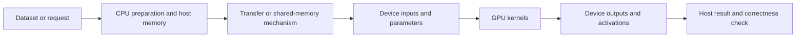

# Month 3: understand what the GPU is being asked to do

A process reports "out of memory," yet `nvidia-smi` can still see its GPU. This is not a contradiction. Device discovery, compatible software, sufficient memory, and correct computation are separate conditions. You will learn enough about tensors and GPU execution to decide which boundary to test first.

**Prerequisites:** months 1-2; tensor-size arithmetic from the bridge. **Assessed bundle:** G1-E03. G1-O05 distinguishes driver, runtime, and device failures. G1-O06 validates a single-GPU workload using actual L1 evidence. The L0 memory lab prepares the diagnosis; it cannot satisfy O06 by itself. Use the [hardware workbook](../labs/systems/hardware-workbook.md) when an approved GPU is available.

## A tensor is data with a shape and a representation

A scalar is one value. A vector is an ordered list of values. A matrix is a rectangular array. A tensor generalizes arrays to any number of dimensions. Shape tells you the number of elements along each dimension; the data type tells you how many bytes represent each element and what arithmetic is possible.

For example, a batch of 256 examples with 4,096 features has shape `[256, 4096]`. A layer can multiply it by a weight matrix of shape `[4096, 4096]` to produce `[256, 4096]`. A model's **parameters** are stored values, such as those weights, adjusted during training. **Activations** are intermediate values produced while computing a result. A **gradient** measures how changing a parameter affects the loss, the numerical error being minimized. You do not need to derive advanced calculus to reason about their memory footprints.

A GPU executes many operations concurrently. A **kernel** is a function launched for device execution. In the discrete-GPU teaching model, the host CPU prepares work and the device performs kernels on device-accessible data. Host and device memory are distinct allocations unless an explicitly supported memory mechanism changes that relationship. Modern platforms differ, so do not generalize the diagram into a claim that every NVIDIA platform has the same memory architecture. The [CUDA programming model](https://docs.nvidia.com/cuda/cuda-programming-guide/01-introduction/programming-model.html) defines the host/device execution concepts.

**Worked example 1: matrix work and a lower bound.** For the `[256, 4096]` input and `[4096, 4096]` weights, there are `256 * 4096` output elements. Each output uses about 4,096 multiply-adds. Counting a multiply and an add as two operations gives `2 * 256 * 4096 * 4096 = 8,589,934,592` floating-point operations, about 8.59 GFLOP.

Suppose, purely for this example, a device could sustain 50 TFLOP/s on exactly this operation. Compute-only time would be `8.59 * 10^9 / (50 * 10^12) = 0.0001718 s = 0.172 ms`. That is not a predicted measured latency: transfers, memory traffic, launch overhead, shape efficiency, and synchronization remain.

At two bytes per value, weights take `4096 * 4096 * 2 = 33,554,432 bytes = 32 MiB`. Input and output each take `256 * 4096 * 2 = 2 MiB`. These three arrays total 36 MiB. Training needs additional saved intermediates and gradients. An optimizer may keep more state. A raw operation count and three payload sizes do not establish end-to-end speed or fit.

## Driver, runtime, framework, and container have different jobs

The **driver** connects software to device management and execution. CUDA supplies programming interfaces and runtime components used by applications. A framework such as PyTorch builds model operations on those interfaces and libraries. A container packages user-space components but still needs compatible device exposure and host support.

Compatibility is an intersection: GPU support, host driver, CUDA requirements, framework build, container configuration, and application features all matter. NVIDIA documents compatibility mechanisms and their restrictions; use the exact relevant toolkit/driver requirements rather than assume a universal one-number rule. See [CUDA compatibility](https://docs.nvidia.com/deploy/cuda-compatibility/latest/why-cuda-compatibility.html).

`nvidia-smi` is a management and observation tool. A successful query does not execute your model. The current documentation calls the maximum CUDA version supported by the user-mode driver **CUDA UMD Version**, with the older **CUDA Version** label deprecated. Older installations can still show the older label. This is not sufficient evidence of the application's installed toolkit or framework build. Record the actual tool output and application versions. NVIDIA also recommends stable UUID/PCI identification over assuming a GPU index remains unchanged across reboot. See the [NVIDIA SMI reference](https://docs.nvidia.com/deploy/nvidia-smi/index.html).

Use a sequence of questions:

1. Does the OS enumerate the target device, and does management identify the expected UUID?
2. Can the intended user/process see and use it in this runtime environment?
3. Can a tiny known computation complete with a correct result?
4. Can the target workload fit within measured memory and resource limits?
5. Is performance acceptable under the stated workload, topology, and concurrency?

A failure at step 4 does not erase successful evidence from steps 1-3. Conversely, success at step 1 does not establish any later step.

## Memory pressure has causes you can calculate

In the supplied synthetic memory model, the GPU has 24,576 MiB of capacity. Reserve 2,048 MiB for unmodeled or unavailable space. Fixed allocations use 6,144 MiB, and each microbatch example adds 2,304 MiB. A **microbatch** is the number of examples processed together by one execution step; it need not equal the total effective training batch when gradients accumulate over several steps.

**Worked example 2: find a safe model boundary.** Usable budget is `24,576 - 2,048 = 22,528 MiB`. At microbatch 8, estimated peak is `6,144 + 8 * 2,304 = 24,576 MiB`, exceeding the budget by 2,048 MiB. At microbatch 4, estimated peak is `6,144 + 4 * 2,304 = 15,360 MiB`, leaving 7,168 MiB of budget headroom.

Solve for the maximum integer microbatch in this linear model: `(22,528 - 6,144) / 2,304 = 7.111...`, so 7 fits and 8 does not. Seven is a mathematical result for the fixture, not a production recommendation. Actual activation sizes can depend on sequence length, dynamic shapes, algorithm choices, temporary buffers, and allocator behavior. Measure peak usage for representative inputs and record a justified reserve.

**Counterexample:** lowering microbatch does not fix a runtime that cannot initialize the device. Also, model weights might already consume more than available memory; then even microbatch 1 cannot fit. Diagnose the fixed and variable components separately.

Gradient accumulation can preserve an intended effective batch while lowering each microbatch, but it changes execution and must preserve the training algorithm's normalization and update semantics. It is not a free throughput improvement. Model parallelism, which divides a model across devices, introduces communication and belongs with the next chapter's topology reasoning.

## Scale-up and hardware error evidence

**Scale-up** connects accelerators within a tightly connected system or domain. NVLink and NVSwitch are NVIDIA technologies used for device communication in supported designs. **Scale-out** connects workers across systems, often through NICs and network switches. Do not infer connectivity from GPU count alone; an actual product topology defines available paths. The DGX H100/H200 is one concrete documented configuration, not the template for every rack. See its [hardware and topology overview](https://docs.nvidia.com/dgx/dgxh100-user-guide/introduction-to-dgxh100.html).

**RAS** means reliability, availability, and serviceability. Error-correcting memory can correct some errors, while other errors need containment or recovery. A counter requires context: device identity, time interval, counter reset behavior, workload impact, and the vendor's documented interpretation. It is not a universal replacement threshold.

NVIDIA **Xid** messages report errors through the driver. On Linux they appear in kernel logging, but interpretation depends on the error and environment. Preserve the message, device identifier, surrounding events, software versions, and reproduction. Use the [Xid guidance](https://docs.nvidia.com/deploy/xid-errors/latest/working-with-xid-errors.html) rather than treating any Xid as proof of broken silicon. DCGM diagnostics assess particular readiness and diagnostic conditions; test scope and modes matter. They can run work and are not interchangeable with passive telemetry. Read the [DCGM diagnostic guide](https://docs.nvidia.com/datacenter/dcgm/latest/user-guide/dcgm-diagnostics.html) before planning a supported diagnostic window.

| Symptom | Retain these hypotheses | Next bounded evidence | Premature conclusion to avoid |
|---|---|---|---|
| Management query succeeds; framework init fails | Driver/runtime mismatch; device visibility; permissions | Framework build, supported compatibility, same-user tiny program | "The GPU is healthy for this workload" |
| Large batch fails; tiny batch works | Memory demand; fragmentation; input-dependent temporary allocation | Peak memory and fixed/variable size calculation | "Reinstall the driver" |
| Correct result, low apparent GPU utilization | CPU/input bottleneck; short kernels; sample interval; synchronization | End-to-end timing plus input and device timeline | "Buy more GPUs" |
| New Xid and job failure | Application error; software stack; device/path fault | Exact Xid scope and vendor-directed diagnostics | "Every Xid means replace the board" |

## Timing asynchronous work

A host call can submit GPU work and return before the device finishes. Timing only the submission can report a misleadingly tiny duration. PyTorch's CUDA documentation requires appropriate synchronization or CUDA events for accurate GPU timing. The optional course workload synchronizes and explicitly includes checkpoint I/O in its elapsed time; it is a correctness/recovery probe, not a benchmark. See [PyTorch 2.8 CUDA semantics](https://docs.pytorch.org/docs/2.8/notes/cuda.html).

Repeat measurements after warm-up, keep shapes and inputs fixed, and report the distribution and measurement scope. Reproducibility across software releases, hardware, or CPU/GPU execution is not guaranteed even with the same seed; use a stated numerical tolerance rather than invented bitwise equivalence. See [PyTorch 2.8 reproducibility notes](https://docs.pytorch.org/docs/2.8/notes/randomness.html).

## Four-week study route

| Week | Study and read | Apply | Review | Total |
|---|---|---|---|---|
| 1 | 3 h: tensors, execution, arithmetic | 4 h: calculate three shapes and draw the host/device path | 2 h: explain omitted memory and timing costs | 9 h |
| 2 | 3 h: driver/runtime boundaries and RAS | 4 h: reproduce and recover L0 memory failure | 2 h: compare competing diagnoses | 9 h |
| 3 | 2 h: hardware workbook and exact environment docs | 5 h: approved L1 observation and bounded workload | 2 h: interpret correctness and timing limits | 9 h |
| 4 | 2 h: revisit missing evidence | 4 h: G1-E03 packet or explicitly pending L1 plan | 3 h: defense and reassessment | 9 h |

## G1-E03: prove the boundary you claim

Initialize the `gpu` L0 scenario and capture the initial check failure. Calculate the maximum microbatch before configuring it. Try both a passing and a failing value at the boundary; compare the healthy control. Explain why driver discovery remains true in both cases. Include at least one alternative diagnosis and the observation that makes it less likely in this fixture.

For O06, follow the [L1 workbook](../labs/systems/hardware-workbook.md): identify the actual GPU and software, run the tiny known CUDA computation, and record real outputs and logs. The author has not executed that CUDA path on hardware. If you have no approved GPU, submit the L0 packet and mark O06 **PENDING L1**. You can continue reading; you cannot claim the hardware outcome passed.

## Checkpoint questions

1. Why can a visible GPU reject a valid application's allocation?
2. Does reducing microbatch guarantee an equivalent training run?
3. Why can a host timer understate GPU execution time?
4. What does a clean tiny workload say about a ten-hour distributed job?

Answer key and misconception check

1. Discovery says the device is visible; capacity and allocation constraints still apply. The fixture's batch 8 needs more than the reserved budget.
2. No. Effective batch, gradient scaling, update frequency, randomness, and optimizer semantics must be preserved or intentionally changed and evaluated.
3. Submission can be asynchronous. Wait for relevant work or use correctly scoped device events; also distinguish transfer, compute, and end-to-end time.
4. It establishes bounded correctness in the tested environment. It does not establish long-duration reliability, distributed communication, thermal behavior, or target workload capacity.

In the linear L0 memory model, values 1 through 7 pass; 8 through 16 fail. The supplied healthy control uses 4 for additional headroom. Passing at 7 does not turn the synthetic reserve into a vendor specification.

**Next:** [Month 4: communication, fabrics, and recoverable checkpoints](04-fabric-storage.md).
