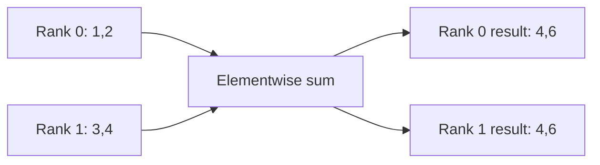

# Month 4: move the right data and recover the right state

A four-worker job can hang on a perfectly functioning network if its workers disagree about what to communicate. A fast storage system can still leave an unusable checkpoint if only three of four shards were committed. This chapter separates transport speed, collective correctness, and recovery correctness before combining them into a workload model.

**Prerequisites:** months 1-3; bytes, rates, matrices, and the host/device path. **Assessed bundle:** G1-E04. G1-O07 distinguishes scale-up, scale-out, and storage bottlenecks. G1-O08 verifies a committed recoverable checkpoint. All numerical scenarios are synthetic. Actual RDMA behavior requires a controlled environment with physical RDMA hardware and its recorded transport; a local simulator cannot establish it.

## Three paths that can all be called "the network"

An Ethernet fabric links network interfaces and switches using Ethernet. Internet Protocol supplies addressing and routing above a link layer; TCP can carry a reliable byte stream above IP. InfiniBand is a different fabric architecture with its own link and transport mechanisms. Do not treat Ethernet and TCP as synonyms, or treat InfiniBand as merely a faster Ethernet cable.

**Remote direct memory access**, or RDMA, lets software arrange communication involving memory registered for use by an RDMA-capable device. It can reduce copies and host CPU involvement relative to a conventional socket path. Registration, permissions, transport, completion handling, and the actual application path matter. RDMA is not a claim that any process can freely read arbitrary remote memory.

NVIDIA's DOCA guide documents RDMA technologies including InfiniBand, RDMA over Converged Ethernet (**RoCE**), and iWARP. RoCE carries RDMA semantics over an Ethernet network. These share API concepts but differ in their network mechanisms. This chapter uses the [DOCA 3.5.0 RDMA guide](https://networking-docs.nvidia.com/doca/archive/3-5-0/rdma-aware-networks-programming-guide). The previous standalone NVIDIA RDMA manual was found deprecated, so it is not used as a current setup authority.

A worker can use several paths:

- A tightly connected GPU path for scale-up communication.
- A GPU/host-to-NIC path and fabric for scale-out communication.
- A storage path for input data and checkpoints.

These may share links or other resources. A topology diagram should say which traffic traverses which bottleneck. A successful TCP control connection does not prove that RDMA transfers are using the intended interface. A benchmark reporting only aggregate bandwidth does not prove every path is balanced.

NCCL, the NVIDIA Collective Communications Library, provides GPU communication operations used by frameworks. Its networking troubleshooting guide separates interface selection, low-level fabric checks, and bandwidth/latency diagnosis. Use that ordering before changing tuning variables. See [NCCL networking troubleshooting](https://docs.nvidia.com/deeplearning/nccl/user-guide/docs/troubleshooting/networking_troubleshooting.html), a rolling URL whose page displayed version 2.31.2 when checked on 2026-10-02. The collective-operations page below displayed 2.32.3 on the same date; these URLs do not establish one pinned documentation release.

## A collective is a contract among participants

A **rank** is a participant's identifier in a distributed group. The **world size** is the number of participants in that group. A rank is not inherently the same as a physical GPU index or server number.

In a sum **all-reduce**, every rank contributes an array and every rank receives the elementwise sum. With two ranks contributing `[1, 2]` and `[3, 4]`, both receive `[4, 6]`. A **reduce** places that combined result at one selected rank. A **broadcast** sends one rank's data to all participants. An **all-gather** assembles every participant's contribution at every rank, preserving rank order. A **reduce-scatter** combines contributions but gives each rank only part of the combined result. NCCL specifies matching participation, counts, and data types for a collective; mismatches can hang, crash, or corrupt data. See [NCCL collective operations](https://docs.nvidia.com/deeplearning/nccl/user-guide/docs/usage/collectives.html).

During synchronous data-parallel training, workers process different data using replicas of the model and synchronize gradients before consistent updates. All-reduce supplies one piece of that mechanism; it does not decide data sharding or whether every worker executes the same sequence of collectives. A worker that exits early can leave peers waiting. Thus a collective timeout can originate in a prior application exception.

**Worked example 1: all-reduce bandwidth bound.** Consider a ring algorithm for four ranks, each with a 2 GB gradient array. This teaching model splits the data into four chunks. A reduce-scatter phase sends three chunks per rank; an all-gather phase sends three more. Per rank, transferred payload is `2 * (4 - 1) / 4 * 2 GB = 3 GB`.

At an effective bottleneck payload rate of 10 GB/s, communication needs at least `3 / 10 = 0.3 s`, ignoring startup, contention, protocol overhead, and imbalance. If computation takes 0.1 s and cannot overlap communication, a step needs at least 0.4 s, or at most 2.5 steps/s. Doubling compute speed changes 0.1 s to 0.05 s, giving at least 0.35 s and at most 2.86 steps/s. Faster compute alone improves this bound only 14.3%.

This is a derivation for one algorithm, not a promise that NCCL chooses a ring or achieves the stated rate. Hardware, message size, topology, algorithm selection, and overlap can change the result. Label the model and compare it to observations.

**Counterexample:** if rank 2 submits 512 elements while the others submit 1,024, increasing bandwidth cannot make the contract correct. First compare operation order, count, data type, participant group, and earlier worker failures. The L0 lab intentionally includes this error alongside healthy modeled network counters.

## Storage is both a performance dependency and a state authority

A dataset is input. A checkpoint is saved state intended to resume a computation. A model export for inference may include only model parameters, while a resumable training checkpoint can need optimizer state, progress, data position, random-number state, and distributed metadata. PyTorch's checkpoint tutorial explicitly distinguishes model saving from general training checkpoints, including optimizer state. See [saving and loading models](https://docs.pytorch.org/tutorials/beginner/saving_loading_models.html).

The exact set depends on the algorithm. This course's tiny linear regression uses deterministic full-batch data and plain SGD without momentum. Its state can therefore be compact: parameters, step, dataset identity, learning rate, and backend. Do not copy that minimal format into a stochastic distributed trainer and assume it preserves training semantics.

A **shard** is one part of a larger saved state. A **generation** identifies a complete checkpoint attempt. If four ranks each save one shard for generation 120, finding three files does not mean generation 120 is resumable. A **manifest** records which complete generation a reader should use, including the files and their integrity metadata.

A useful publication sequence is:

1. Write a new generation without changing the currently published generation.
2. Verify all required pieces and their integrity.
3. Publish the manifest identifying that complete generation.
4. Readers follow the published manifest and validate the referenced content.
5. Retain an older valid generation until the recovery/retention policy permits removal.

This separates **atomic visibility**, where readers choose a coherent published version, from **durability**, where the data survives the specified failure. A checksum detects an unintended content mismatch against trusted metadata; it is not authentication if an attacker can replace both payload and checksum.

Python documents `os.replace` as an atomic rename when successful, with filesystem constraints. It does not turn a multi-file checkpoint into one transaction or by itself prove power-loss durability. The course implementation writes a payload, then replaces a manifest and validates a hash during restore. It is a local process-interruption model. It does not test filesystem crash recovery, directory durability, network storage, or an object store's consistency semantics. See [Python 3.11 filesystem operations](https://docs.python.org/3.11/library/os.html).

**Worked example 2: select a usable generation.** Generation 100 has four verified shards and a published manifest. Generation 120 has three shards and no committed manifest. The correct recovery choice is 100, even though 120 is numerically larger. If each training step takes 2 s and the process had completed step 123, restoring 100 repeats 23 steps or 46 s of compute. That lost work is preferable to pretending a mixed/incomplete state is valid.

Now suppose a full checkpoint contains 80 GB and storage sustains 4 GB/s for this job. Payload writing alone takes at least `80 / 4 = 20 s`. If the job computes for 600 s between saves and saving is serial, one cycle takes 620 s; save overhead is `20 / 620 = 3.23%`. Under the explicit simplifying assumption that failures are uniformly distributed over the 600 s compute interval, average lost compute is 300 s. Shorter intervals reduce recomputation but increase save overhead. Real optimization also needs failure rates, overlap, storage contention, and checkpoint failure behavior, which this simple example does not provide.

## Distinguish a slow link from a waiting worker

| Symptom | Competing explanations | Evidence to gather first | Recovery implication |
|---|---|---|---|
| Collective hangs | Count/order mismatch; rank exited; transport failure | All rank logs and collective metadata, not only the waiting rank | Correct workload or transport cause before retry |
| One rank lags | Data skew; CPU/NUMA path; link degradation | Per-rank timings and identical-input control | Fix the slow stage; fast ranks may only be waiting |
| Checkpoint is slow | Bandwidth limit; metadata overhead; concurrent writers | Bytes, elapsed time, file count, concurrent load | Adjust schedule or layout only after measurement |
| Newest checkpoint will not restore | Partial generation; checksum failure; incompatible schema | Manifest, all pieces, hashes, version/dataset identity | Use verified prior generation or stop; never invent missing state |
| TCP works, RDMA fails | Different interface/path/configuration | Actual chosen transport and vendor-supported low-level checks | Keep claim at TCP until RDMA is demonstrated |

## Four-week study route

| Week | Study and read | Apply | Review | Total |
|---|---|---|---|---|
| 1 | 3 h: paths, transport, and collective contracts | 4 h: work the four-rank example and draw data paths | 2 h: distinguish model from measurement | 9 h |
| 2 | 3 h: checkpoint state and publication | 4 h: recover L0 collective/checkpoint scenario | 2 h: explain why one fix leaves another failure | 9 h |
| 3 | 2 h: local implementation and limits | 5 h: execute interrupted training and validate restore | 2 h: compare with uninterrupted control | 9 h |
| 4 | 2 h: targeted rereading | 4 h: G1-E04 evidence and changed-input attempt | 3 h: defense and remediation | 9 h |

## G1-E04: prove communication agreement and recoverable state

Initialize the `fabric` scenario. Observe and check before changing anything. Fix only the collective count and rerun; record the remaining checkpoint failure. Choose a checkpoint from the evidence and justify it. Compare the recovered configuration with a separate healthy control.

Then run the real local file exercise from [the lab README](../labs/systems/README.md): uninterrupted reference training, interruption after step 23, and resume from the published step 20. Compare final predictions. In a separate disposable attempt, alter a referenced checkpoint file and prove that restore rejects its checksum. Preserve the original attempt; do not overwrite evidence. These two activities belong to the same G1-E04 packet, not separate mandatory assessments.

Include both worked calculations with changed numbers, all-rank agreement evidence, manifest/hash evidence, recovered correctness, and limitations. L0 establishes the teaching contract and local-file behavior only. Follow [the hardware workbook](../labs/systems/hardware-workbook.md) for the boundaries of controlled L2/RDMA work.

## Checkpoint questions

1. Why does successful TCP rendezvous not prove RDMA data movement?
2. In the ring example, why is payload per rank 3 GB rather than 2 GB?
3. Why is generation 100 safer than an incomplete generation 120?
4. What does successful rename prove, and what does it not prove?
5. If one worker runs out of GPU memory, why might the other workers report a network-looking timeout?

Answer key and misconception check

1. Control and data paths can use different interfaces and transports. Record the path actually selected and verify its behavior.
2. Each of the two phases sends three of four chunks: `2 * 3/4 * 2 GB`. This is specific to the simplified ring derivation.
3. Generation 100 has a complete committed state. Larger step numbers are not integrity evidence.
4. Atomic replacement gives an old-or-new name binding for that operation when successful. It does not prove all shards exist, validate their meaning, or guarantee survival of every storage/power failure.
5. A failed worker may never enter a required collective. Peers can wait until timeout even if their network links are functional. Inspect the earliest failure across ranks.

The L0 scenario passes with `rank2_count` 1024 and `resume_step` 100. Fixing only one is insufficient by design. The real local training exercise should resume from 20, replay three lost steps, and match the uninterrupted Python control's final predictions.

**Next:** [Month 5: power, thermal, telemetry, and security boundaries](05-power-telemetry-security.md).
