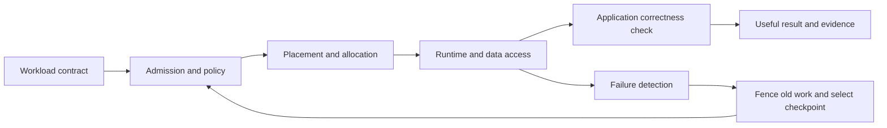

# Month 7: Write the workload contract before choosing the scheduler

Your decision this month is what a workload needs to make useful progress. A scheduler can place processes and reserve resources; it cannot infer whether the resulting computation is correct, whether its checkpoint is usable, or whether its latency meets a user's need. This chapter connects the systems knowledge from months 1-6 to either complete platform track.

Prerequisites: explain a process, container, CPU request, GPU device, network path, and persistent storage; distinguish throughput from useful completed work. If those terms are unfamiliar, revisit the shared systems core. No prior Kubernetes or Slurm experience is assumed here.

**Evidence scope:** platform facts below were checked against official sources on 2026-10-02. Numerical examples and the resource model are course constructions. The model is not either scheduler's implementation. The six platform assessment bundles and twelve outcomes are fixed in [G2](../assessments/gates.md); this chapter prepares **G2-E01 / G2-O01 and G2-O02**.

## Terms that prevent expensive misunderstandings

A **workload** is the application plus its input, required resources, execution relationships, and completion rule. A **task** is one unit of execution. A **rank** is a participant's identifier in a cooperating computation. A **replica** is another instance of a service; replicas may serve independent requests, whereas training ranks may all have to rendezvous. Never infer independence from the fact that there are several containers.

**Admission** decides whether work may enter an execution pool under policy. **Placement** chooses eligible resources. **Allocation** reserves those resources for an execution. **Runtime enforcement** prevents a process from exceeding an applicable boundary. A quota is a cap, a priority is an ordering influence, and fair share accounts for entitlement and consumption over time. None of these words alone specifies the other mechanisms.

A **checkpoint** is application state with enough identity and integrity information to resume a compatible computation. A log line saying "saved" is weaker evidence than a fresh process restoring that checkpoint and producing the same verified result. **Recovery point** describes how much useful work might be lost; **recovery time** includes detection, policy decisions, queueing, input access, restore, and revalidation. These definitions are the course's operational vocabulary.

## Start with a contract, then identify its owner

Use the following table as a completed example, then write your own. The values describe a fictional synchronous training job; they are not hardware recommendations.

| Field | Example contract | Why the scheduler needs it or cannot own it |
|---|---|---|
| Identity | Run `train-017`, dataset digest D, code digest C, checkpoint schema 2 | The application must reject incompatible state |
| Goal | Complete 1,000 validated steps; loss values finite | Process exit alone does not establish this |
| Shape | 2 workers, 1 GPU and 4 CPU cores per worker, 24 GiB RAM each | Allocation needs both count and per-worker shape |
| Coordination | Both workers required before progress; rendezvous timeout 120 s | Partial startup can occupy resources without progress |
| Topology | Same fabric class; cross-rack allowed if measured step time meets budget | A label can identify a class but cannot prove performance |
| Data | Input read-only; one committed checkpoint generation every 100 steps | Storage semantics and writer ownership matter |
| Interruption | Retry only after previous writers are fenced; maximum 2 attempts | Duplicate execution can corrupt output |
| Fairness | Account `research`; waiting time target 30 min, not guaranteed | Policy and available capacity determine feasibility |
| Acceptance | Restore test, final result check, resource/queue history | Combines scheduler evidence and application evidence |

Write "unknown" when a value is unmeasured. For instance, do not invent a network bandwidth requirement from GPU count. An unknown topology sensitivity becomes a controlled measurement in months 9-10, not an automatic request for the most expensive fabric.



## Worked example 1: Enough total capacity, no feasible placement

Suppose two nodes each have three free GPU-sized resource units. A job needs two workers, each needing two units. If workers may use different nodes, place one on each: `3 - 2 = 1` unit remains per node. Four units are allocated and two are stranded for this job shape.

Now add a requirement that both workers occupy the same rack, and put the two nodes in different racks. The cluster has six free units, which exceeds the four requested, but neither rack has four. The job must wait. Dividing total free resources by requested resources would predict success and would be wrong because it ignores the placement domain.

There are three distinct interventions. Wait until one rack has sufficient free capacity; reduce the worker shape after an application sizing test; or relax the same-rack condition after a performance test. Raising priority does not manufacture a feasible domain. Changing the label without changing the actual topology falsifies evidence.

Run the transparent model from the repository root:

```sh
python3 labs/platforms/l0/queue_recovery.py --output .cache/platform-evidence/placement.json
```

Expected: `healthy.state` is `ADMITTED`, `broken.state` is `PENDING`, and `recovered.placement` is `["a", "b"]`. The recovered case explicitly changes `same_domain` from true to false. Explain why this is a contract change, not a free optimization. This model atomically admits all workers by construction; it does not prove Kubernetes or Slurm has that configuration.

## Worked example 2: Checkpoint cost and useful progress

Assume a step takes 2 seconds and a checkpoint takes 10 seconds. Saving every 100 steps incurs 10 seconds of checkpoint time per 200 seconds of computation. Ignoring all other overhead, the useful-time fraction is `200 / 210 = 95.2%`. Saving every 10 steps yields `20 / 30 = 66.7%`. More frequent saving reduces potential lost computation but increases overhead.

If failure occurs after 37 steps since the last committed checkpoint, up to 74 seconds of computation is lost in this example. If detection takes 20 seconds, requeueing 90 seconds, restore 15 seconds, and validation 5 seconds, recovery takes at least `20 + 90 + 15 + 5 = 130` seconds before useful execution resumes. Checkpoint frequency changes lost work; it does not remove queue delay.

The familiar half-interval estimate for average lost work needs a failure-time distribution roughly uniform within the interval. Do not report that estimate as a measured result when failures correlate with long checkpoint writes or particular steps. Also separate successfully saved bytes from a committed, mutually consistent set of rank states.

The supplied [workload](../labs/platforms/workload.py) sums squares and records a single writer's progress. It deliberately exits with status 75 after a selected durable write. A second process validates state and continues. This teaches recovery identity and correctness, not distributed optimizer state or power-loss durability.

```sh
python3 labs/platforms/workload.py --directory .cache/platform-evidence/restart --steps 12 --fail-after 5
# Expected nonzero exit: 75. Preserve the output; it is the injected failure.
python3 labs/platforms/workload.py --directory .cache/platform-evidence/restart --steps 12
python3 -m unittest discover -s labs/platforms/l0 -p 'test_*.py' -v
```

Expected second result: `resumed_from: 5`, `completed: 12`, `total: 650`, `correct: true`. Use a new directory for a fresh attempt. Changing `--steps` in an existing directory must reject the checkpoint, because run identity changed.

## Translate meaning, not command spelling

| Concern | Kubernetes reference track, v1.34 | Slurm reference track, 25.05.3 |
|---|---|---|
| Unit of placement | Pod; controllers create and replace Pods | Job allocation; steps launch within it |
| Completed batch work | Job controller records successful completions | Batch job reaches a terminal state; steps have their own status |
| Coordinated worker startup | Default Pod scheduling does not make an entire Job one atomic allocation | A multi-node job requests an allocation; application launch/rendezvous still needs validation |
| "Gang scheduling" | Often used for coordinated workload admission in ecosystem discussions; select and verify the actual mechanism | Documented GANG mode time-slices jobs by suspend/resume |
| Fairness | Namespace ResourceQuota caps resources; it is not historical project-usage accounting | Multifactor priority can use fair-share history when accounting is configured |
| Recovery | Replacement Pod is a new execution; checkpoint restoration belongs to application/integration | Requeue starts batch execution again; checkpoint restoration belongs to application/integration |

These are scoped comparisons, not permanent claims about every extension or later release. See official [Kubernetes scheduling framework](https://v1-34.docs.kubernetes.io/docs/concepts/scheduling-eviction/scheduling-framework/), [Jobs](https://v1-34.docs.kubernetes.io/docs/concepts/workloads/controllers/job/), [ResourceQuota](https://v1-34.docs.kubernetes.io/docs/concepts/policy/resource-quotas/), [Slurm gang scheduling](https://slurm.schedmd.com/gang_scheduling.html), and [Slurm multifactor priority](https://slurm.schedmd.com/priority_multifactor.html).

Counterexample: a stateless inference service can often add or remove independent replicas behind a request router. Applying the training contract's "all replicas must start together" rule could worsen availability unnecessarily. Conversely, treating tightly coupled training ranks as independent service replicas can leave running workers waiting forever. Begin with application behavior.

## Four-week study plan: 8-10 hours per week

| Week | Study and practice | Evidence |
|---|---|---|
| 1 | 3 h terms/mechanisms; 3 h trace a training and inference request; 2 h review | Two contracts with unknowns and ownership |
| 2 | 2 h placement example; 3 h model variants; 3 h explain rejected interventions | Feasible/infeasible placements with arithmetic |
| 3 | 2 h recovery example; 3 h failure/restore lab; 3 h compare application and scheduler state | Failed and recovered outputs, integrity check |
| 4 | 3 h revise contracts; 3 h defend platform translation; 2 h remediation | G2-E01 packet; optional 0-2 h peer review |

The primary and secondary tracks start next month. Their combined work stays in this weekly budget; do not add two full calendars together. Choose [Kubernetes](../tracks/kubernetes/README.md) or [Slurm](../tracks/slurm/README.md) as primary based on the operating environment you need to learn, not a claim that one universally replaces the other.

## Questions: answer before reading the key

1. Why can a four-unit job remain pending when six units are free?
2. What evidence distinguishes a restarted process from recovered useful work?
3. A team requests a higher quota to fix slow collective communication. What is unproven?
4. When does retrying a failed rank alone make the situation worse?
5. Does Slurm GANG mode solve Kubernetes multi-Pod admission? Explain the category error.

<details>
<summary>Reasoned answers</summary>

1. Total capacity ignores the shape and topology constraints. In the example, each rack has only three units and the entire four-unit allocation must fit in one rack. Show a feasible placement rather than relying on a total.
2. A fresh process must identify the intended checkpoint, restore compatible state, resume at the recorded boundary, and pass the application result check. A new PID or green controller condition proves less.
3. Quota controls admission bounds, while communication time depends on placement, message size, application behavior, and physical paths. Measure where time is spent before changing either policy or topology.
4. If ranks share synchronized state or the previous rank remains active, a lone replacement can join an incompatible generation or create two writers. The contract needs fencing, rendezvous generation, and a coordinated recovery boundary.
5. They refer to different mechanisms. Slurm's documented GANG mode time-slices jobs; coordinated Kubernetes admission depends on its selected scheduler/controller integration. Similar terminology is not evidence of equivalent behavior.

</details>

Submit both contracts, the model's three states, a failed/recovered computation, and five rows explaining native differences. Do not claim either native platform has been deployed from this chapter alone.
