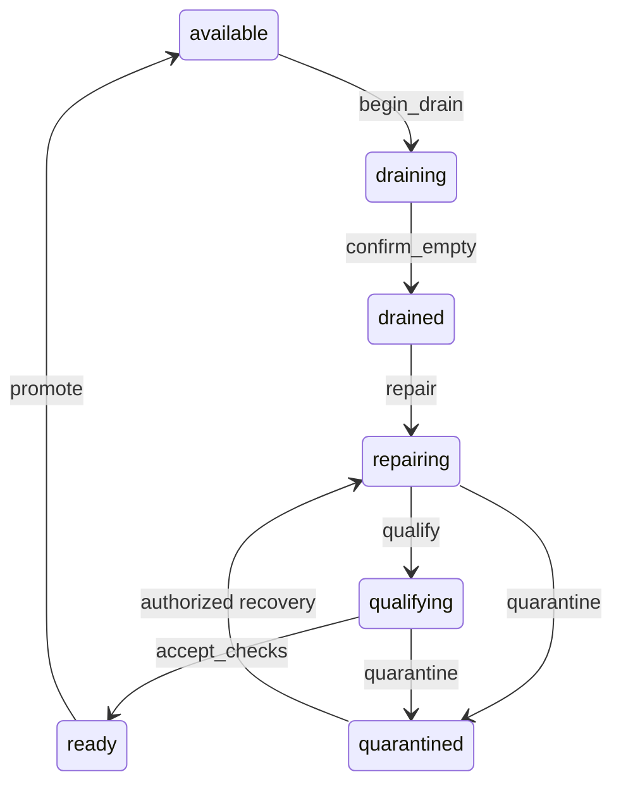

# Month 16: Make lifecycle automation safe under retries and races

A script can run every command successfully and still produce the wrong system state. Your goal is to make the permission to act explicit, then prove that stale information cannot authorize the next step. **G3-E04** assesses **G3-O07**, safe lifecycle transitions, and **G3-O08**, rejecting stale or duplicate unsafe actions. This is bounded external automation, not a new general-purpose control plane.

## Begin with invariants, not commands

An invariant is a statement that must remain true through every allowed transition. "Only qualified assets accept new work" is an invariant. "Run this repair script" is an action. Starting from invariants exposes missing conditions before code makes them hard to see.

For this exercise:

- Repair begins only after admission is closed and zero active workloads are confirmed.
- Promotion follows workload, inventory, and telemetry checks for the current generation.
- An action names the expected state generation; a changed generation requires a new decision.
- Replaying an already applied request cannot apply its side effect twice.
- Reusing a request ID for different intent is rejected.
- A failed qualification remains visible; recovery creates new evidence rather than overwriting the failure.

A generation is a monotonically increasing logical version. It identifies the state you read, not wall-clock time. Two clients reading generation 4 can race even if their clocks are perfectly synchronized.



This graph is a course model. It omits real vendor-specific substates. Refresh and decommission reuse the admission and drain invariants, then branch to separate terminal or qualification paths; they are not permission to reuse the repair action unchanged.

## Why idempotency and concurrency are different

Idempotency means repeating the same intent has no additional effect after the first successful application. It does not mean "ignore all later calls with similar payloads." Two identical-looking requests may represent distinct intended operations. A stable request ID carries the caller's intent across a retry.

Verified public fact: AWS's documented idempotent API approach uses caller-provided request identifiers and rejects a repeated identifier with changed parameters. Durable request tracking and the associated mutation need coordinated atomicity. [Making retries safe with idempotent APIs](https://aws.amazon.com/builders-library/making-retries-safe-with-idempotent-APIs/)

Optimistic concurrency means a client proposes a change conditional on the version it read. The server checks the condition atomically with the mutation. A preflight read followed by an unconditional write has a race between the two operations.

Verified public fact: Redfish DSP0266 version 1.20.2 specifies conditional modification using ETags and `If-Match` for resources supporting those ETags. Treat the ETag as an opaque version token. This protocol feature is not evidence that a particular device implements every optional operation. [Redfish specification 1.20.2, sections 6.5 and 7](https://www.dmtf.org/sites/default/files/standards/documents/DSP0266_1.20.2.html)

## Worked example 1: one lost response, two competing clients

**Synthetic state trace.** An asset is `qualifying`, generation 4. Client A has good checks for generation 4 and submits request `accept-7`. Client B has just observed a reason to quarantine and submits a different request, also expecting generation 4.

Suppose A wins the conditional update. State becomes `ready`, generation 5. Its response is lost. B's request must now fail its generation check rather than silently move a newly changed state. B rereads generation 5, examines whether its quarantine concern still applies, and proposes a new valid action if supported by policy. The course model deliberately has no automatic `ready -> quarantine` action: do not invent an escape hatch merely to force the example through.

A retries `accept-7` with the identical payload. The idempotency record reports the previous application; generation stays 5. If A retries the same ID with `telemetry: false`, that is a parameter conflict, not a retry. Sorting arrival timestamps cannot provide these guarantees; only the authoritative transition check can.

**Counterexample.** A script checks generation 4, sleeps, and writes unconditionally after B changed the state. Both preflight checks were correct when they ran. The system still loses an update because the condition and write were separate.

## Worked example 2: qualification failure and explicit recovery

**Synthetic sequence.** Start `available`, generation 0. Drain admission at generation 1, confirm zero workloads at 2, enter repair at 3, and begin qualification at 4. Workload and inventory checks pass; telemetry fails. Promotion remains blocked at generation 4.

Quarantine creates generation 5. Authorized recovery enters repair at 6. A new qualification attempt enters generation 7. Passing all three checks tied to generation 7 creates `ready`, generation 8, then promotion creates `available`, generation 9.

The final generation is 9, not 6, because recovery was real work with visible state transitions. The failed check remains in the event history. If old passing checks from generation 4 are submitted at generation 7, their success is irrelevant to the new state. The binding between check and generation prevents that stale evidence from authorizing promotion.

**Counterexample.** Clearing a failure flag and retaining the previous qualification timestamp can make a dashboard green without testing the repaired state. It destroys the difference between "checked" and "assumed."

## Reconciliation, asynchronous completion, and CI

A reconciler repeatedly compares desired and observed state, chooses one bounded next action, and then observes again. It should be safe to restart between iterations. Request acceptance is not completion: a long-running task can fail later. Verified public fact: Redfish asynchronous operations may return HTTP 202 and a task-monitor location; clients must inspect the operation's subsequent status rather than treat 202 as completed work. [Redfish specification 1.20.2, asynchronous operations](https://www.dmtf.org/sites/default/files/standards/documents/DSP0266_1.20.2.html)

Separate three tests. A pure transition test checks legal state changes. An integration test checks a real API's errors, tasks, and authentication. A hardware qualification checks the resulting supported system. Passing the first does not imply the other two.

A useful CI sequence is: validate schema and compatibility inputs; test invariants and replay; reject stale/duplicate intent; exercise failure-to-recovery; inspect generated evidence; require human review for newly expanded side effects. A compatibility matrix records exact participating versions and the authority for their supported combination. A green test on one tuple does not validate the cross-product of all versions.

## Executable exercise

```sh
python3 labs/fleet/fleet_lab.py lifecycle labs/fleet/fixtures/lifecycle-contention.json
python3 labs/fleet/fleet_lab.py lifecycle labs/fleet/fixtures/lifecycle-fault.json
python3 -m unittest discover -s labs/fleet -p 'test_*.py' -v
```

1. Predict every state and generation in the contention fixture before running. Mark duplicate, stale, and conflicting-ID events separately.
2. Explain why the fault fixture ends blocked. Preserve the failure.
3. Create a new event history that reaches generation 9 using explicit quarantine and recovery. Use the worked example to reason, not the provided recovered fixture as a submission.
4. Change `workloads` to 1 during drain. Demonstrate that repair cannot begin.
5. Change a qualification's `check_generation` to an old value. Demonstrate rejection, then create genuinely current synthetic check evidence.
6. Write one additional meaningful invariant test: for example, an unauthorized `resume_repair` must not change generation. Run it with the existing suite.

Submit transition predictions, original and recovered outputs, your additional test, and a one-page production-gap review. Required gaps include durable state, atomic persistence across crashes, distributed fencing, identity binding, task polling, authentication, and the real admission boundary. The supplied simulator is single-process replay; it demonstrates event-order interleavings, not distributed correctness.

## Questions

1. Why is a request ID insufficient to prevent stale intent?
2. What must happen when a known ID arrives with changed parameters?
3. What can HTTP 202 establish about an asynchronous operation?
4. Why must passing checks be tied to a generation or equivalent immutable state?
5. Can a successful simulator replay prove crash-safe exactly-once hardware mutation?

## Reasoned answers

1. The request might be new but based on an obsolete state. Concurrency checking protects the state precondition; idempotency protects repeat execution of the same intent.
2. Reject it as conflicting intent. Returning prior success would mislead the caller about which operation actually ran.
3. Acceptance for processing according to that protocol. It does not prove completion or qualification; follow the task and then inspect the resulting state.
4. A change after the check can invalidate it. Without a binding, old evidence can authorize a new, untested configuration.
5. No. The simulator has no durable transaction boundary or external hardware effects. Crash recovery and uncertain external completion require separately tested protocols.

## Four-week study plan

| Week | Nine-hour allocation | Result |
|---|---|---|
| 1 | Invariants 3h; trace examples 3h; source reading 3h | State/guard design |
| 2 | Replay and failures 4h; test extension 3h; review 2h | Tested transition package |
| 3 | Recovery trace 3h; CI and production-gap analysis 4h; defense 2h | G3-E04 draft |
| 4 | Remediation 4h; altered event order 3h; archive 2h | Assessed bundle |

Continue to [Month 17](17-capacity-and-readiness.md).
