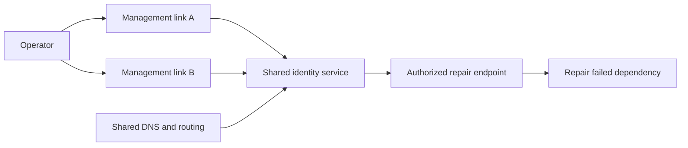

# Meta: can you repair the network without the network?

**Decision question:** Before approving a change to a shared backbone, what evidence would convince you that operators could reverse it if routing, name resolution, and normal administration all disappeared together?

The tempting assumption is that a second management link supplies an independent recovery path. That holds only if its dependencies also survive. This case studies recovery as a dependency problem. The teaching model below is an inference; the historical account is separately attributed.

## Mechanism: count surviving paths, not interfaces

A recovery action requires more than a reachable router. The operator may need a route, a name lookup, an identity service, credentials, a privileged endpoint, and an executable procedure. If any mandatory dependency fails, that path is unavailable. Two physical links can share the same mandatory identity or routing dependency.

In reliability reasoning, a **cut set** is a set of failed components sufficient to disconnect the required path. A shared service can be a cut set of size one even when every device has two network ports. A diagram that shows only cables therefore answers the wrong question.

This deliberately simplified diagram describes a possible design, not Meta's unpublished management topology:



The important test is a transaction: from an available operator location, obtain authorization and perform a bounded repair while the declared failed services remain unavailable. A ping through a spare link proves much less.

## Published account

**Reported by the operator:** On October 4, 2021, a maintenance command intended to assess backbone capacity disconnected Facebook's data centers. A defect in the command-auditing system allowed it through. The following account describes the company's explanation, not an independent reconstruction. [Meta's detailed postmortem](https://engineering.fb.com/2021/10/05/networking-traffic/outage-details/)

The report says authoritative DNS locations withdrew their BGP advertisements after losing connectivity to the data centers. The DNS servers remained operational but became unreachable. Both primary and out-of-band administration were unavailable, and lost DNS impaired internal tools. Engineers went onsite; physical and system security procedures added recovery time. [Meta's dependency and access account](https://engineering.fb.com/2021/10/05/networking-traffic/outage-details/)

After restoring the backbone, teams controlled the return of traffic rather than restoring all load at once. The report identifies concerns involving power demand and caches, and says prior failure drills helped manage that recovery. Meta proposed expanding its drills, which had not previously simulated loss of the entire global backbone. [Meta's recovery account](https://engineering.fb.com/2021/10/05/networking-traffic/outage-details/)

## Worked example: redundancy behind a shared gate

**Synthetic assumptions:** At a randomly sampled instant, each of two management links is available with probability 0.999. Their failures are independent. A shared authorization service is available with probability 0.995 and is independent of both links. Repair requires authorization and at least one link. These are invented probabilities, not measurements of Meta.

The probability that both links fail is `0.001 * 0.001 = 0.000001`. Therefore:

```text
P(at least one link works) = 1 - 0.000001 = 0.999999
P(repair path works) = 0.995 * 0.999999 = 0.994999005
```

The link pair alone appears 99.9999% available. The complete path is approximately 99.5% available. Adding a third equally reliable link barely changes the result because the shared gate dominates.

Over a hypothetical 30-day window with stationary probabilities, expected unavailable time is `43,200 * (1 - 0.994999005) = 216.04 minutes`. The link-only calculation would predict `43,200 * 0.000001 = 0.0432 minutes`. Neither predicts the longest outage, repair duration, or whether a particular emergency occurs during an outage.

The assumptions matter more than the decimal places. If a configuration change disables both links together, multiplying independent failure probabilities is invalid. Measure and test the shared failure modes before using a reliability estimate to approve the design.

## What would you do?

A team demonstrates two management circuits, but both require the production identity provider. It proposes approving a global routing change because both circuits passed yesterday's connectivity check. What additional acceptance evidence do you require?

<details>
<summary>Reasoned answer</summary>

Require a controlled exercise in which the production routing and identity dependencies are unavailable while an authorized operator completes the intended recovery transaction. Record the exact credentials, access location, authorization boundary, device identity, and restoration evidence. Include the case where the ordinary documentation portal is unreachable. An independently usable path must still enforce authorization and preserve an audit trail. If the exercise cannot demonstrate that path, reduce the change's simultaneous scope until a surviving recovery route is established.

</details>

## Tradeoffs and counterfactual

**Course judgment:** Preserve strong access control while engineering a separately testable emergency path. Removing authentication would trade an availability problem for uncontrolled change authority. A separate path adds credential lifecycle, monitoring, and exercise costs; an unused path can silently decay.

A plausible counterfactual is that limiting a change to one independently recoverable domain would preserve a place from which to diagnose and reverse it. That is conditional on the control system actually containing propagation. A small initial target does not help if the command changes globally shared state.

## Transfer to AI infrastructure

**Course inference:** Map the recovery dependencies of a GPU cluster before treating its management network as independent. Include the scheduler API, identity provider, secrets store, console path, artifact repository, DNS, and runbook location. Then separately test admission control during restart: restoring reachability does not prove the cluster can absorb queued jobs or simultaneous model loading.

Connect this exercise to [telemetry and access boundaries](../curriculum/05-power-telemetry-security.md), [incident recovery choices](../curriculum/15-incidents-and-change.md), and [lifecycle invariants](../curriculum/16-lifecycle-automation.md).

**Evidence limits:** The cited account omits the command, audit defect, and detailed access topology. No internal logs or present-day controls were examined.
