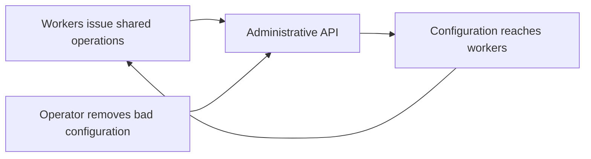

# OpenAI, December 2024: can you still operate the system you overloaded?

**Decision question:** An observability change uses little CPU on each worker and passes a small-cluster trial. What evidence would justify deploying it to a much larger fleet?

The assumption to challenge is that a small per-worker cost implies a small system cost. Count both how many workers issue an operation and how much shared work each operation causes. Also ask whether the recovery action uses that same shared resource. A control service can become the bottleneck even while application workers have spare capacity.

## Published account

**Verified source; operator account.** OpenAI reports service degradation or unavailability from 15:16 to 19:38 PST on December 11, 2024. A new telemetry configuration made nodes issue expensive Kubernetes API operations whose cost increased with cluster size. Large clusters lost control-plane availability. DNS caches delayed application symptoms, allowing the rollout to spread. In OpenAI's deployment, failing service discovery connected control-plane overload to application failures.

Removing the telemetry service required the overloaded API. Responders reduced cluster size, blocked access to administrative APIs, and increased API-server resources to regain control and remove the service. Recovery also encountered simultaneous resource downloads. OpenAI proposed phased rollouts, fault injection, and emergency API access. The account identifies a scale-sensitive testing gap; it does not establish that every Kubernetes deployment has the same DNS dependency. [OpenAI's incident report](https://status.openai.com/incidents/ctrsv3lwd797)

## Mechanism: multiply the callers by the work per call

**Course model, not a reconstruction of OpenAI's implementation.** Let `N` workers each issue `r` requests per second. If a request costs `c(N)` units of shared work, offered load is:

```text
shared load L(N) = N * r * c(N)
```

If each request examines a fixed-size record, `c(N)` can be constant. If each request examines information about every worker, a simple model is `c(N) = k*N`. Total work then grows with `N^2`. A tenfold increase in workers produces a hundredfold increase in shared work, despite an unchanged request rate at each worker.

This is a workload model, not a claim that any particular Kubernetes operation is quadratic. Determine the real cost from request traces, response sizes, server work, and dependency behavior. Client CPU alone does not measure server work. Average request counts can also hide synchronized bursts.

There is a second question: can an operator reduce the load while the shared service is saturated? Drawing deployment and recovery as separate arrows exposes a circular dependency:



The diagram describes the teaching model. If all requests enter one exhausted queue, knowing the correct change does not guarantee being able to apply it.

## Worked example: the small trial passes

**Synthetic inputs.** Each worker issues `0.1` requests/s; each request costs `N/100` work units. The shared service can complete `400` units/s, and unrelated essential work consumes `100` units/s. Assume constant capacity, no retries, and an initially empty queue.

| Quantity | 100-worker trial | 1,000-worker deployment |
|---|---:|---:|
| Telemetry requests/s | 10 | 100 |
| Work units/request | 1 | 10 |
| Telemetry work units/s | 10 | 1,000 |
| Total offered work units/s | 110 | 1,100 |

The trial fits comfortably. The larger deployment adds work `1,100 - 400 = 700` units/s faster than it can finish. After 60 seconds, the simplified queue contains `42,000` units. Completely stopping telemetry leaves `400 - 100 = 300` units/s for draining it, so clearance takes another `42,000/300 = 140` seconds.

The queue does not disappear when the change stops. Retried requests, variable costs, or a server becoming less efficient under overload can lengthen this interval. Conversely, safely discarding obsolete queued work can shorten it. The calculation is a capacity argument, not a latency prediction for the historical outage.

## What would you do?

A synthetic canary runs for five minutes without application errors. Its discovery cache retains entries for fifteen minutes, and API completion latency is rising. Expand, extend observation, or revert?

<details>
<summary>Reasoned answer</summary>

Stop expansion and investigate the API regression. The application result has not exercised cache expiration. Run representative fresh-discovery transactions and measure shared-service work at the intended cluster scale. Establish a tested way to reduce the offending traffic before considering another rollout. Extending the timer alone is insufficient if the canary cannot generate the relevant load. Revert through a verified path if the regression threatens the control service; repeated attempts through an exhausted path may consume the remaining capacity.

</details>

## Mitigations, tradeoffs, and counterfactual

Reserve capacity for essential administration and put limits before expensive work begins. A limit applied after a costly lookup protects a response channel while leaving the underlying bottleneck exposed. Separate credentials are useful for authority, but separate credentials do not themselves reserve processing capacity.

Test dimensions that change the cost function: worker count, object count, burst synchronization, and cache state. Longer trials cost time; representative scale costs resources. Choose them from the mechanism being tested rather than a universal canary duration.

**Counterfactual:** even perfect application caching would only postpone this model's administrative failure. It could preserve serving temporarily, but would not restore the ability to change configuration. Conversely, a reserved recovery path could shorten an incident without preventing its initial workload impact. Prevention and recoverability deserve separate acceptance checks.

## Transfer to AI infrastructure and limits

**Course inference.** Evaluate GPU telemetry, inventory agents, and model-serving controllers against their shared metadata costs. A rack can retain compute capacity while losing placement, discovery, or repair capability. Trace these dependencies in [Kubernetes operability](../tracks/kubernetes/11-operability.md), then write recovery preconditions using [Month 15](../curriculum/15-incidents-and-change.md).

Confidence is high in the published sequence as OpenAI's account and in the arithmetic under its stated assumptions. This case does not reproduce production behavior, identify the telemetry code, establish a universal API threshold, or verify the present deployment.
