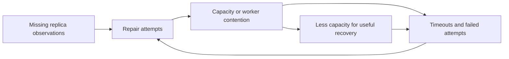

# Case 11: EBS recovery traffic becomes part of the failure

**Decision question:** A storage cluster has lost replica connectivity. Should it create replacement replicas as quickly as possible, or restrict repair work while some data has reduced redundancy?

The attractive assumption is that more repair effort always means faster recovery. That holds only while the repair path has available resources and makes progress. A controller can repeatedly request a resource that does not exist and consume the resources needed to restore it.

## Published account

**Verified operator account:** AWS's April 29, 2011 report describes an April 21 network change in one US East Availability Zone that incorrectly shifted traffic onto a lower-capacity network. Lost replica connectivity prompted EBS re-mirroring. After connectivity returned, concurrent searches exhausted free storage capacity; insufficient retry backoff and a race causing node failures amplified the situation. Long-running requests also exhausted shared control-plane threads, affecting APIs beyond the original zone. [AWS postmortem, Primary Outage](https://aws.amazon.com/message/65648/)

Recovery included suppressing futile searches, isolating the affected cluster's control-plane traffic, and adding storage capacity. The account distinguishes data-path effects from regional API effects. **Limit:** This is AWS's retrospective account of its 2011 design, without customer-independent traces; it does not describe current EBS internals. [AWS postmortem, recovery and prevention sections](https://aws.amazon.com/message/65648/)

## The mechanism: repair needs a budget

**Teaching model:** A replica is unavailable from an observer's perspective, but its bytes might still exist. A partition and a destroyed disk can therefore produce the same immediate symptom while demanding different repairs. Creating another copy preserves options; discarding the unreachable copy before establishing authority and durability may destroy them.

That conservative choice has a capacity cost. During recovery, old copies, replacement copies, incomplete transfers, and normal writes can coexist. Steady-state free space is not automatically enough for the transient peak. Nor does total free space guarantee usable space: placement rules may forbid the free devices because they share the surviving replica's failure domain.

Feedback then matters. A failed attempt can create retries, timeout work, bookkeeping, or another failure. If each failed operation creates an average of more than one additional operation before completing, demand can grow even after the original trigger disappears. Removing the trigger is necessary but does not guarantee that the feedback process has drained.

This diagram is a general teaching model, not a reconstruction of AWS's internal implementation.

## Worked example: two different shortages

**Synthetic storage assumptions:** Forty replicas of 1 TB each need replacement. Existing copies remain retained. Only 20 TB of free space satisfies placement rules, and there is no compression or reclamation during repair. The demand is `40 * 1 = 40 TB`; the shortfall is 20 TB before adding any safety reserve. Repeating placement discovery cannot make the missing space appear.

Suppose the network can dedicate 2 GB/s to copying. Using decimal units, copying 40 TB needs at least `40,000/2 = 20,000 seconds`, or 5 hours, 33 minutes, 20 seconds. That is a bandwidth-only lower bound. With the stated space shortage, the whole repair cannot complete at all until the capacity constraint changes.

**Synthetic worker assumptions:** A control service has 100 blocking workers. Requests to the impaired storage group arrive at 12 per second and occupy a worker for 30 seconds. Supporting that offered load would require `12*30 = 360` simultaneous workers. With 100 workers, the completion ceiling under these assumptions is `100/30 = 3.33 requests/s`; a queue or rejection must absorb the difference.

Partitioning the worker pool so the impaired group may occupy at most 25 workers preserves 75 for other groups. It does not restore a single missing replica, but it changes the scope of unavailability. The service also needs bounded queues or admission rejection; merely moving an unlimited queue outside the pool moves the eventual exhaustion elsewhere.

**Question:** Is lowering the timeout enough to fix both shortages?

Reasoned answer

No. It can release workers sooner, but clients may retry sooner too. Without admission control and retry limits, the request rate can increase. A shorter timeout also creates no storage space. Separate containment from progress: bound unsuccessful work, preserve essential coordination, establish usable capacity, and measure completed replica creation rather than attempted repairs.

## Tradeoffs and transfer

**Inference for AI infrastructure:** The same reasoning applies when many training jobs simultaneously restore checkpoints, repopulate caches, or request replacements after a shared failure. The survivor pool can be healthy and still lack capacity for both normal service and recovery. Model the restoration traffic separately from steady-state demand.

Aggressive repair reduces the time spent with fewer copies if spare capacity exists. Conservative admission protects the surviving service but lengthens exposure to another loss. A useful policy therefore considers remaining independent copies, actual repair completion rate, eligible free space, and the consequence of delaying each workload. Blanket retry suppression is as poorly targeted as unlimited retry.

The counterfactual is not simply a larger cluster. Extra storage would address the numerical shortfall above, while worker isolation would address regional coupling; either alone leaves the other mechanism possible. Specify which causal edge each investment removes.

Connect the case to [storage and checkpoint authority](../curriculum/04-fabric-storage.md), [containment and recovery choices](../curriculum/15-incidents-and-change.md), and [automation under retries](../curriculum/16-lifecycle-automation.md). This case does not establish contemporary cloud capacity reserves, retry policies, or application recovery times.
