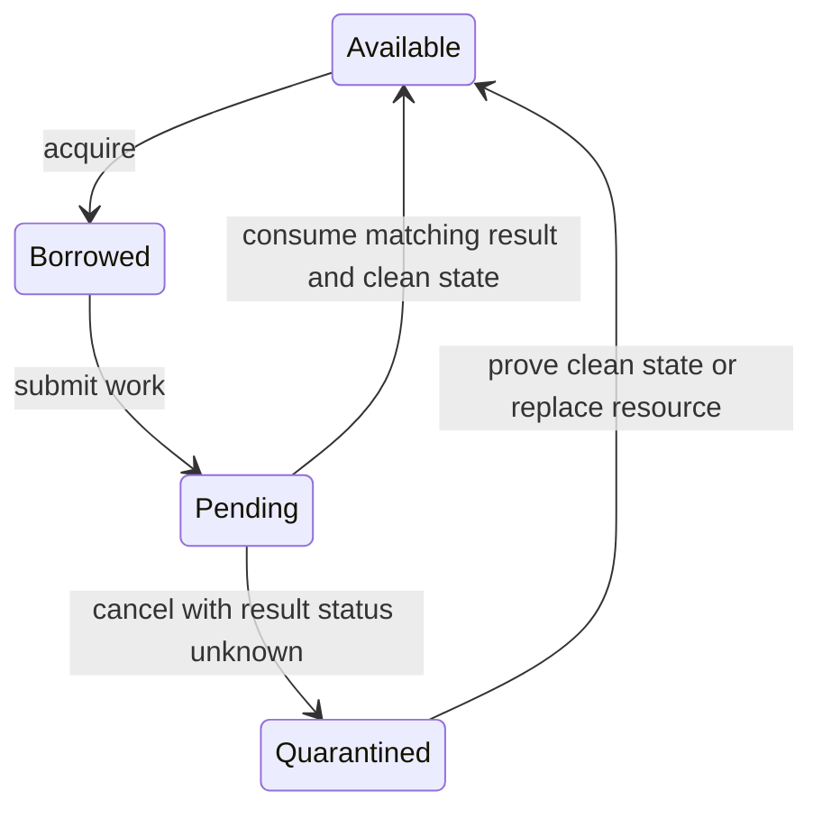

# OpenAI, March 2023: a successful response can still belong to someone else

**Decision question:** What proves that a response belongs to the requesting user when shared infrastructure reuses connections and requests can be cancelled?

The assumption to challenge is that a correctly typed, successful response is necessarily a correct response. Availability asks whether work completed. Confidentiality also asks who was entitled to receive the result. A system can satisfy a superficial success check while crossing an authorization boundary.

## Published account

**Verified source; operator account.** OpenAI's March 24, 2023 report attributes the March 20 ChatGPT incident to a cancellation-related bug in the Asyncio Redis Cluster client in `redis-py`: a reused connection could return another request's data. Some users saw other users' chat titles; first messages could also have appeared. ChatGPT was taken offline, patched, and restored, with history returning later and some history unavailable.

OpenAI reported possible payment-information exposure for 1.2% of Plus subscribers active during 01:00-10:00 Pacific on March 20. Potential fields included name, email, payment address, card type, last four card digits, and expiration; full card numbers were not exposed. That percentage describes a potentially affected active subset, not all users or confirmed disclosures. OpenAI also reported adding checks that cached data matched the requesting user. [OpenAI's incident explanation](https://openai.com/index/march-20-chatgpt-outage/)

## Mechanism: ownership must survive asynchronous work

**Course model, not the library's source code.** Imagine a shared resource that carries ordered requests and responses. Its lifecycle needs more state than `free` and `busy`:



The dangerous assumption is that cancellation of a caller proves cancellation of all work it initiated. Model these as separate events. A caller can stop waiting while a downstream operation is still executing. Returning its resource to the pool requires a clear rule about outstanding work and unconsumed results.

That lifecycle rule protects one boundary. Application authorization protects another. A result should carry enough trusted identity to verify the requested tenant, resource, and operation. Checking only its schema answers whether the application can parse it. Checking only that the requester is logged in answers who is asking. Neither, by itself, demonstrates entitlement to the specific returned object.

For a hypothetical retrieval service, define correctness as all of these holding: the response matches the request identity, the resource belongs to an allowed tenant, the requesting principal may read it, and the version is acceptable. The checks need authoritative metadata. Copying a tenant label from the request onto an otherwise unidentified result would merely assert the property being tested.

## Worked example: rare errors in a high-volume system

**Entirely synthetic probabilities.** Consider `10,000,000` requests per day. Suppose `0.2%` are cancelled; of those, `0.05%` leave an unsafe shared-resource state; and, conditional on that unsafe state, `20%` yield another user's result that passes a superficial response check.

```text
Cancelled requests = 10,000,000 * 0.002 = 20,000
Unsafe states = 20,000 * 0.0005 = 10 expected per day
Accepted foreign results = 10 * 0.20 = 2 expected per day
```

The multiplication uses conditional probabilities; it does not assume these stages are independent. The rates are invented, and the expected value is neither an observed count nor a guaranteed maximum. A correlated burst could produce a very different daily result.

Two responses among ten million are `0.00002%`. An availability counter that counts both as successful might not decrease at all. Even a counter that noticed and classified both as failed would show `99.99998%` success if every other request succeeded. That percentage cannot establish acceptable confidentiality. The outcome and its denominator differ from ordinary downtime accounting.

Define and test the isolation invariant directly; a high completion rate is an unsuitable proxy.

## What would you do?

A client update passes throughput tests and ordinary success/error tests. No test cancels requests while shared work is outstanding. Is that enough evidence to restore a feature that returns private tenant data?

<details>
<summary>Reasoned answer</summary>

No. Test the relevant lifecycle boundary with synthetic tenants and unmistakably different fixtures. Exercise cancellation at controlled stages, resource reuse, and mismatched-result rejection. Verify both the client cleanup rule and the application authorization check. Preserve failure evidence without recording real private payloads. Restore in a bounded deployment only after the expected isolation invariants hold, and monitor for their violation separately from availability. A performance test does not supply the missing identity evidence.

</details>

## Mitigations, tradeoffs, and counterfactual

Quarantining an uncertain resource can reduce reuse and increase connection setup cost. Reusing it safely requires stronger lifecycle evidence. Tenant-specific pools can narrow a failure's scope but increase resource consumption, and they still need to distinguish permissions among resources within a tenant.

Keep authorization checks near the point where private data leaves the service. Avoid assuming that an earlier request check automatically validates a later response. Log identifiers and rejection reasons with an appropriate data policy; copying sensitive response bodies into an incident log can create another disclosure path.

**Counterfactual:** clearing a cache could remove existing contents without repairing unsafe resource reuse. Conversely, rejecting every mismatched result could protect confidentiality while causing visible request failures. That would be a better failure mode for the stated privacy requirement, but the underlying reliability defect would still need correction.

## Transfer to AI infrastructure and limits

**Course inference.** Apply identity checks to retrieval results, prompt history, model artifacts, checkpoint ownership, and cached inference outputs. Plausible content is especially weak evidence of correct ownership. Connect required identities to the [workload contract](../curriculum/07-workload-contract.md) and access boundaries in [power, telemetry, and security](../curriculum/05-power-telemetry-security.md).

Confidence is high in the reported scope and conditional arithmetic. This page does not inspect the patch, reproduce the bug, count confirmed disclosures, or assess current `redis-py` versions or OpenAI systems.
