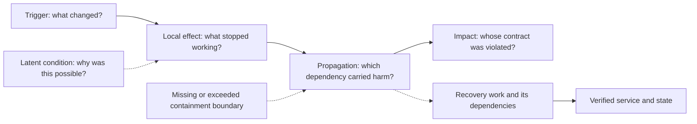

# Read a postmortem as a set of testable explanations

Your goal is to leave with a model you can challenge, not a memorable story about somebody else's mistake. Ask: **what had to be true for this local event to create this much harm, and what evidence would show that our system is different?**

This method is original course guidance. The historical evidence belongs to the individual [case studies](README.md). For the underlying vocabulary, read [system dependencies](../curriculum/01-system-map.md) and [incident response](../curriculum/15-incidents-and-change.md).

## Keep four kinds of statement separate

| Label | What it means | Example of appropriate wording |
|---|---|---|
| Published account | A claim made by the cited operator or research authors | "The report attributes the interruption to..." |
| Course model | An intentionally simplified system or calculation | "Assume six workers, equal capacity, and no spare placement..." |
| Inference | A conclusion whose premises you must expose | "If our recovery endpoint shares this dependency, it may fail too." |
| Unknown | Something the available record cannot decide | "The report does not establish whether this exact test existed." |

Confidence in reading a report accurately is different from confidence that it contains every relevant cause. A source can support the existence of an event without supporting your estimate of recurrence. Preserve its date, system scope, and stated uncertainty. Do not invent a timeline when the source describes an aggregate study.

## Draw the mechanism before choosing the lesson

Use this skeleton, then replace each box with a specific statement from the case. Not every case has every arrow. Dashed arrows mean a contributing condition, not a measured sequence.



The trigger could be a command, a request, a component failure, or a combination of states. Calling it the root cause ends the analysis too soon if it leaves propagation unexplained. "An operator ran the command" does not explain why the command could affect the whole fleet, why the preview failed to bound its effect, or why the repair path was unavailable. Equally, do not assume those safeguards were absent merely because the report is silent about them.

Give each arrow its own evidence. A timeline showing that deployment preceded latency is evidence of order. It does not by itself distinguish a deployment defect from a traffic increase or a concurrent dependency failure. A rollback followed by recovery strengthens one explanation, but a rollback may also lower load or restart a broken connection pool. Ask which alternative explanations remain.

## Audit the claimed redundancy

List the failure you are trying to tolerate before counting replicas. Then trace shared power, network, configuration, identity, data, and recovery dependencies. Two healthy replicas can still be unable to serve a request whose authorization depends on a third service.

**Synthetic example.** Suppose service success requires a usable identity service and at least one of two workers. For a deliberately simplified observation interval, let the identity service fail with probability `q = 0.01`. Conditional on identity working, assume independent worker failures with probability `p = 0.02` each. The modeled service failure probability is:

```text
P(failure) = q + (1 - q) * p^2
           = 0.01 + 0.99 * 0.0004
           = 0.010396 = 1.0396%
```

Counting only the two workers would give `0.04%`. Under the stated assumptions, the shared dependency dominates. These are invented probabilities, not an availability estimate for any provider. Independence must be justified; a global configuration defect would invalidate the independent-worker term. Service success also requires sufficient capacity, an assumption this small model deliberately leaves out.

## Separate restoration, reconciliation, and proof

Restoration makes a needed operation possible again. Reconciliation determines how competing or incomplete state should be handled. Verification establishes the specific service contract you claim to have restored. These can finish at different times.

Write the recovery graph next to the normal dependency graph. Include the credentials, control endpoint, name resolution, storage, artifacts, people, and communications used to recover. An emergency path is useful only for the failure it actually survives. A second URL through the same failed system does not establish independence.

For stateful work, identify the last known valid recovery point and the evidence of validity. A timestamp does not prove that every shard was committed. A checksum can show that bytes match a recorded value while leaving unanswered whether those bytes were correct when recorded. See the [silent corruption case](10-silent-corruption.md) for that distinction.

## Turn a lesson into a falsifiable action

"Improve monitoring" and "be more careful" do not specify a condition whose improvement can be measured. A useful corrective action has a failure mechanism, an owner role, a concrete change, a verification experiment, and a residual limitation.

| Weak action | More useful course proposal | What it still does not prove |
|---|---|---|
| Add a canary | Expand only after the canary's expensive input path has been exercised and its shared dependencies stay within a defined budget | A finite test covers all valid inputs |
| Add backups | Restore a selected generation into an isolated target and check completeness plus an application invariant | Future backup generations remain recoverable |
| Add another region | Demonstrate the surviving region's capacity and recovery dependencies under the specified regional fault | Independence from a global bad configuration |
| Alert earlier | Inject a bounded missing-source condition and show a fresh signal reaches the responsible role | The same path survives every incident |

These are proposed experiments, not claims about changes a historical operator made. Keep a separate line for actions actually reported by the source.

## Stop before reading the answer

For each case, write five short statements: user impact, causal chain, strongest competing explanation, next safe action, and recovery evidence. Only then open the reasoned answer. If your action differs, compare its assumptions rather than simply marking it wrong.

**Practice question:** in the synthetic redundancy model above, somebody proposes a third independent worker as the entire reliability fix. How much does the modeled failure probability change, and what decision follows?

<details>
<summary>Reasoned answer</summary>

With the same conditional-independence assumptions, the worker term becomes `p^3 = 0.000008`. Total failure probability becomes `0.01 + 0.99 * 0.000008 = 0.01000792`, or `1.000792%`. That is a reduction of `0.038808` percentage points from the two-worker model. It barely changes the shared dependency's 1% contribution.

A third worker might still be valuable for capacity, maintenance, or a different fault model. It does not substantiate the claim that the identity failure has been addressed. Ask for an explicit service behavior during identity unavailability and a test of that behavior. The calculation supplies a conditional comparison, not a universal architecture recommendation.

</details>

Continue to [the casebook](README.md) or use [the review workshop](review-workshop.md) to practice a complete review.
