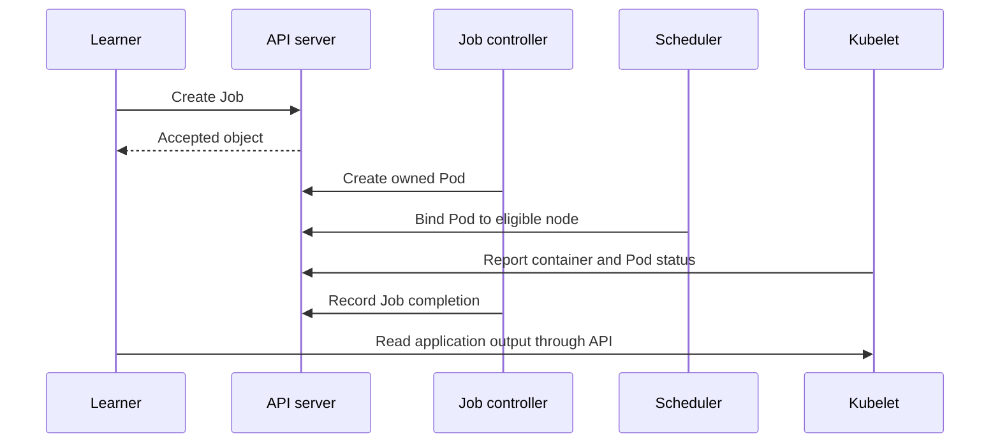

# Month 8: From a declarative request to a running process

The problem is to explain why an accepted workload is not yet a useful result, then construct a reference environment whose behavior you can inspect. By the end, you should trace a Job from API request to verified output without treating "kubectl succeeded" as the end of the story. This prepares **G2-E02 / G2-O03 and G2-O04**.

Prerequisites: month 7's workload contract, containers, CPU/memory, and persistent storage. Kubernetes terms are introduced here. The reference is v1.34; the official [component description](https://v1-34.docs.kubernetes.io/docs/concepts/overview/components/) is the factual source for the component roles below.

## The system is several cooperating loops

The **API server** validates and exposes objects. **etcd** stores cluster state. A **controller** repeatedly compares desired and observed state and takes bounded actions; a Job controller creates Pods to obtain the requested number of successful completions. A **scheduler** selects a node for an unscheduled Pod. The **kubelet** on that node coordinates container execution through the runtime. Network and storage integrations provide additional prerequisites. None of these components runs your scientific correctness check on your behalf.

A **Pod** is a scheduling/lifecycle unit containing one or more containers. A **Job** describes finite work; a **Deployment** maintains replaceable service replicas. A **namespace** scopes many API objects. It is not a virtual machine or a separate kernel. A **ServiceAccount** gives a workload an API identity, and RBAC grants that identity particular operations. Names are reusable; object UIDs distinguish different object instances with the same name.

A **ConfigMap** is an API object for non-secret configuration data that a workload can consume, including as mounted files. This lab mounts its short Python program from a ConfigMap so you can inspect the exact code independently of the image. Secrets do not belong in that object. See [ConfigMaps](https://v1-34.docs.kubernetes.io/docs/concepts/configuration/configmap/).



This is a teaching simplification of interacting asynchronous loops, not a strict transaction. An accepted object can remain unschedulable; a bound Pod can fail an image pull; a running program can produce invalid output. Diagnose the last transition supported by evidence.

## Worked example 1: Accepted, bound, running, correct

Suppose a Job requests one successful completion. At time 0, the API returns a Job UID. At time 1, its controller creates Pod P. At time 2, P receives node N. At time 3, the image pull fails. At this point:

| Claim | Supported? | Required evidence |
|---|---|---|
| The request was accepted | Yes | Job UID/resource version |
| A node was selected | Yes | Pod `spec.nodeName` |
| The application started | No | Container state has not reached running |
| The result is correct | No | No application result exists |

Correcting registry access lets the kubelet start the container. The application computes the sum of squares from 1 through 12. Work it out: `12 * 13 * 25 / 6 = 650`. A terminal successful Job plus output `total=650` establishes more than either alone. It still does not prove all input data was correct in a real training run; our example has deliberately transparent input.

The distinction matters operationally. Deleting and recreating the Job while the registry is unavailable changes identity and may lose history but does not repair the dependency. Read events and container state before changing the workload.

## Worked example 2: Request, limit, and capacity

Imagine a worker has 2 allocatable CPU cores and 1 GiB allocatable memory after node reservations. One Pod requests 500 millicores and 128 MiB, with limits of 1 core and 256 MiB. Four such Pods can fit by the simplified request arithmetic: `4 * 0.5 = 2` cores and `4 * 128 = 512 MiB`. Their limits sum to 4 cores, but the node cannot create CPU time beyond its physical capacity.

Requests influence scheduling; limits constrain runtime use. CPU limits can cause throttling. Memory limits can lead to termination when memory cannot be satisfied under enforcement. An idle node reading does not erase already reserved requests. This distinction comes from [resource management](https://v1-34.docs.kubernetes.io/docs/concepts/configuration/manage-resources-containers/).

Resource arithmetic is only part of feasibility. **Affinity** expresses requirements or preferences about nodes or nearby Pods: for example, use nodes whose label says they are in rack A. A **NoSchedule taint** on a node blocks new placement of Pods without a matching **toleration**; for example, reserve a node for permitted workloads. These are policy filters, separate from available CPU. Storage constraints and other filters also apply. Month 9 works through them; see [taints and tolerations](https://v1-34.docs.kubernetes.io/docs/concepts/scheduling-eviction/taint-and-toleration/).

Counterexample: asking for 2 CPUs because a process briefly used 2 CPUs can prevent two jobs from sharing capacity even if each can meet its objective with 500m. Conversely, setting requests very low to increase apparent packing can create runtime contention. Measure workload service goals and usage together before tuning.

## Construct the reference and prove its path

Read [the runbook](../../labs/platforms/kubernetes/README.md) for checksum-verified local tools and prerequisites. It creates a uniquely named kind cluster and a private kubeconfig; it does not target your current cluster.

```sh
bash labs/platforms/kubernetes/run.sh create
bash labs/platforms/kubernetes/run.sh apply
bash labs/platforms/kubernetes/run.sh inspect
bash labs/platforms/kubernetes/run.sh rbac
```

Expected: one control-plane node and one worker report Ready, `cpu-check` completes, and its application output gives `650`. The reader identity may list Pods in `course-platform` but cannot delete them, read Secrets, or list Pods in `default`. The workload uses no mounted API token. The learner running the lab is an administrator of this disposable cluster; that is distinct from the workload's identity.

Primary Build work: read every field in the Job, namespace/RBAC, and kind configuration. Draw the dependency chain for image access, ConfigMap volume, node eligibility, and result retrieval. Change a copy of the CPU request within the quota, predict the scheduling effect, and capture the observed result with exact versions. Secondary Run work: execute the provided representative Job and explain its lifecycle using its own UID, events, and output.

If creation fails, inspect Docker availability and resource allocation before retrying. If no Pod exists, inspect Job events and admission; if a Pod is Pending, inspect scheduling conditions; if assigned but waiting, inspect container reasons; if it exits, inspect exit code and logs. Do not fix all four by increasing CPU requests.

## Four weeks in the combined platform budget

| Week | Primary 5 h | Secondary 2 h | Evidence/review 1-3 h |
|---|---|---|---|
| 1 | Trace components and asynchronous states | Read other platform's control path | Compare acceptance and execution |
| 2 | Construct and inventory reference | Run other platform's CPU workload | Save exact versions and results |
| 3 | Explain and vary resource requests | Inspect other platform's allocation | Verify predicted versus observed state |
| 4 | Repair one failed prerequisite | Explain native lifecycle | G2-E02 evidence and remediation |

## Questions

1. The API accepted a Job but no Pod exists. Is kubelet the first suspect?
2. Why can the sum of CPU limits exceed allocatable CPU while Pods are scheduled?
3. Does a namespace imply a separate security kernel?
4. A Job reports Complete but the answer is 649. What passed and what failed?
5. Why record object UIDs rather than only names?

<details>
<summary>Reasoned answers</summary>

1. No. The failure precedes a kubelet receiving a bound Pod. Examine controller progress, admission rejection, and Job events first. A working controller cannot overcome a denied Pod creation.
2. Scheduling considers requests for this model, whereas CPU limits cap possible runtime consumption. Limits are not promises that every Pod can simultaneously consume that much CPU.
3. No. Namespace-scoped API authorization is useful but shares cluster components and, on a node, the kernel. Workload privileges and network/data boundaries need separate controls.
4. The Job's completion criterion passed, while the application correctness criterion failed. The course requires both. A process can exit zero after a logical error.
5. Deleting and recreating an object can reuse its name. UIDs prevent events, logs, and retry histories from being accidentally attributed to the wrong instance.

</details>
