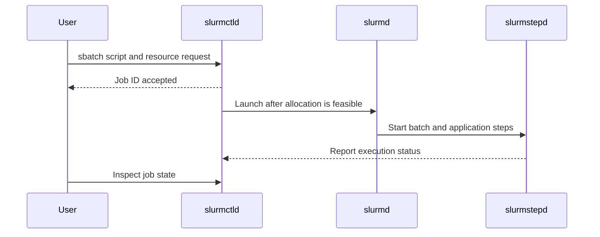

# Month 8: A job allocation is not a container replica

The problem is to understand what Slurm grants when it accepts and starts a job. You will construct a small native reference and distinguish controller decisions from application execution. This prepares **G2-E02 / G2-O03 and G2-O04**. Prerequisites: Linux processes, user IDs, CPU/memory, and the shared workload contract; no prior Slurm knowledge is required.

## Follow the allocation and its steps

The **slurmctld** controller manages work and resource state. **slurmd** runs on a compute node and launches execution, including **slurmstepd** processes for job steps. A **partition** groups nodes and scheduling limits; it is not a filesystem partition. `sbatch` submits a batch script, `salloc` obtains an interactive allocation, and `srun` launches tasks/steps, obtaining an allocation when used appropriately outside one. See [the administrator guide](https://slurm.schedmd.com/quickstart_admin.html).

A **job allocation** is a reservation of resources under the requested shape and policy. A **step** executes some work within an allocation. A **task** is one launched process, while `--cpus-per-task` describes CPU resources associated with a task. `--ntasks=4` and `--cpus-per-task=4` are therefore not interchangeable: one asks for four tasks; the other asks for four CPUs per task. Launch behavior still depends on how the script invokes `srun` or the application. [The versioned sbatch manual](https://raw.githubusercontent.com/SchedMD/slurm/slurm-25-05-3-1/doc/man/man1/sbatch.1) provides these option semantics.

Slurm authentication and Linux execution identity must also agree. The reference uses MUNGE for authenticated messages and consistent Linux users. A scheduling account is not a Unix account: later chapters use accounts to organize project entitlement and accounting associations.



This is a conceptual control path; it does not imply the controller carries application data or that a Job ID proves execution has begun.

## Worked example 1: Four tasks versus four CPUs

Assume a node has 8 schedulable CPUs. Job A asks for 4 tasks, each with 1 CPU. Its total CPU request is `4 * 1 = 4`. Job B asks for 1 task with 4 CPUs, also totaling four. Capacity arithmetic is identical, but execution is not.

If A launches `srun` with four tasks, it can start four copies of a single-process executable. If the application already starts its own worker processes, four copies may oversubscribe or duplicate work. B is appropriate for one process that uses four threads, but an application that remains single-threaded may leave three allocated CPUs unused. The scheduler reserves resources; it does not automatically rewrite the program's parallelism.

The teaching job uses one task and one CPU so that the arithmetic is visible. Its application computes through 100 steps: `100 * 101 * 201 / 6 = 338,350`. The workload includes artificial delay to make an interruption observable; it is not a CPU performance benchmark.

## Worked example 2: Accepted job, unavailable node

A user runs `sbatch job.sbatch` and receives job 42. The node daemon is not registered because its configured CPU topology disagrees with detected hardware. The job remains pending. `squeue` describes waiting work; `scontrol show node` and controller/node logs explain the resource state.

Re-submitting the script creates job 43 but does not fix registration. Raising job priority likewise cannot make an invalid node eligible. The correct next step is to compare `slurmd -C` with the NodeName configuration, memory allowance, node identity, authentication, and daemon reachability. The reference runbook deliberately requires measured hardware values rather than assuming every VM exposes the same topology.

After registration, the job may launch and then fail because its script path or working directory is wrong. That is a different boundary: the controller succeeded in allocation, but the execution prerequisites failed. Preserve both the job state and application stderr before editing.

## Build the dedicated reference

Follow [the VM runbook](../../labs/platforms/slurm/runbook.md). It provides source/version verification, authentication setup, measured node configuration, daemon startup, submission, queueing, requeue, completion evidence, and cleanup. It must run in an owned disposable Linux VM, never by replacing a workstation's or employer's Slurm configuration.

After setup, the essential read commands are:

```sh
scontrol ping
sinfo -N -l
scontrol show config
squeue -u "$USER" -o '%.18i %.9P %.20j %.8T %.10M %R'
```

Expected: the controller responds, the course node is available, and the configured cluster is `rack-course`. Submit the provided job only after the runbook's cluster guard passes. Expected result is an accepted Job ID, RUNNING while the delayed calculation proceeds, then an application result of 338,350. A job disappearing from `squeue` is not by itself proof of success; inspect retained output and completion evidence.

The minimal configuration uses basic priority, no SlurmDBD accounting, and no cgroup enforcement. This keeps the single trusted-user reference explicit. It is not safe evidence of hostile multi-tenant isolation. Chapter 11 explains how the cgroup and database profiles alter both prerequisites and claims.

Counterexample: installing Slurm in a container and naming several fake nodes can demonstrate some interfaces, but it does not create independent kernels, NICs, or failure domains. The reference chooses one honest VM over pretending that process count proves rack scale.

## Four weeks, 8-10 hours total across both platforms

| Week | Primary 5 h | Secondary 2 h | Evidence/review 1-3 h |
|---|---|---|---|
| 1 | Trace controller, allocation, step, task | Trace Kubernetes lifecycle | Explain identity and acceptance |
| 2 | Build and inventory the VM reference | Run other platform's representative job | Preserve versions and output |
| 3 | Work task/CPU examples and registration checks | Inspect counterpart placement | Compare request and execution shape |
| 4 | Repair one seeded prerequisite problem | Explain native secondary execution | G2-E02 and remediation |

## Questions

1. Does an accepted Job ID mean the batch script has started?
2. Why do four tasks and one four-CPU task need different application reasoning?
3. Is a Slurm account identical to a Unix UID?
4. What should you inspect before changing a node marked invalid or down?
5. Does the reference demonstrate multi-tenant CPU/device enforcement?

<details>
<summary>Reasoned answers</summary>

1. No. It records accepted submission; allocation and launch happen later when policy and resource state permit them.
2. They may reserve the same total CPUs but launch different numbers of processes and require different threading/communication behavior. Reserved resources are not automatic useful parallelism.
3. No. Unix identity governs process/filesystem identity; Slurm accounts organize associations and scheduling/accounting policy. Both must be designed coherently.
4. Compare detected hardware and configured resources, node names, authentication, reachability, and logs. A state change that ignores the failed prerequisite may merely hide the symptom.
5. No. It intentionally lacks cgroup enforcement and uses trusted work in one disposable VM. The advanced profile needs actual denied-access and resource-containment tests.

</details>
